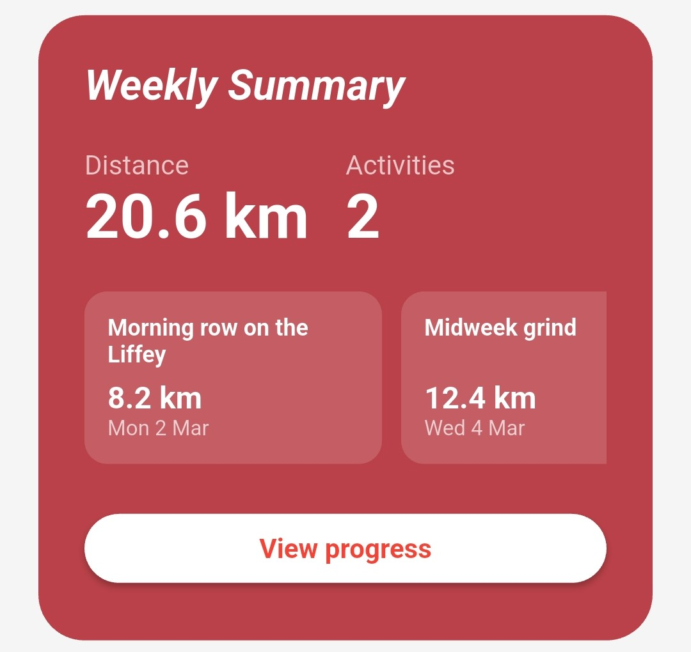
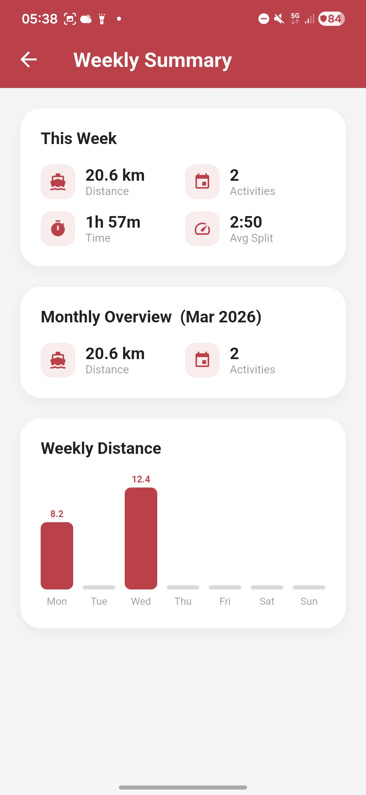
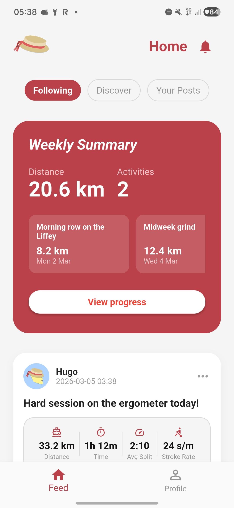
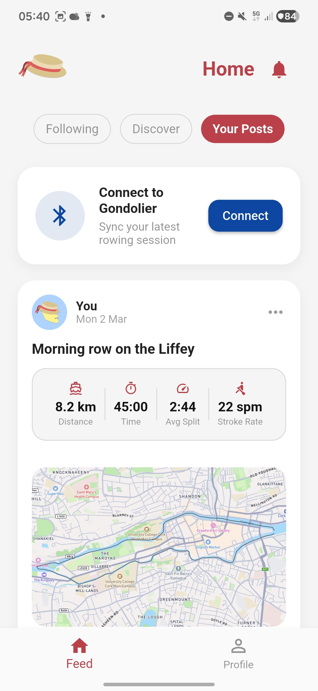
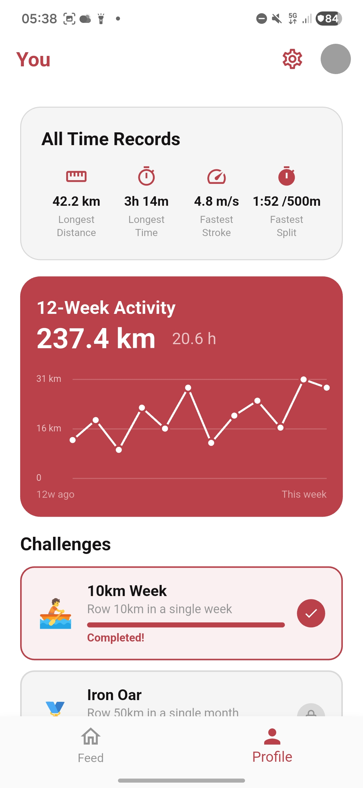
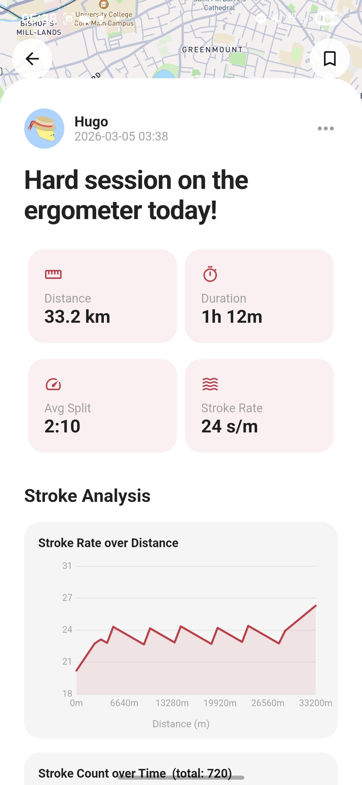
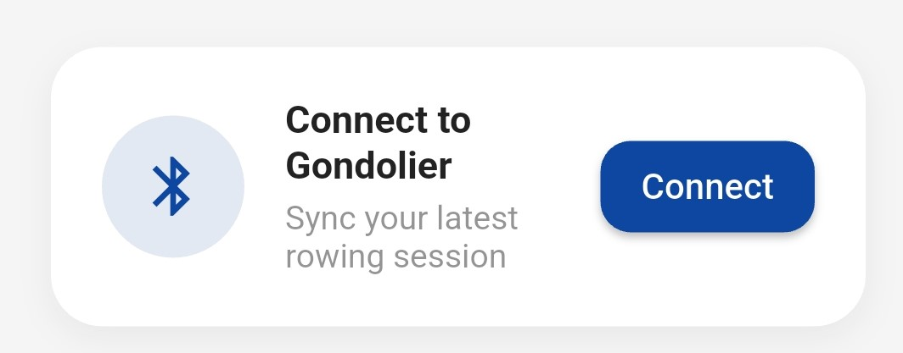

# Gondolier - Group 4 - Team Project

An Open Source Rowing Monitor and Application

Project Logo


## Group Members

| Member | GitHub |
| --- | --- |
| Hugo Guenebaut | [hugo-gu](https://github.com/hugo-gu) |
| Emin Aksoy | [EAksoy7](https://github.com/EAksoy7) |
| Roxana (Nixie) Turcu | [roxieturcu](https://github.com/roxieturcu) |
| Mark Cannavan | [MCannavan](https://github.com/MCannavan) |
| Hleb Slyusar | [Slowlybomb](https://github.com/Slowlybomb) |
| David Fresno | [molfresh](https://github.com/molfresh) |


## Preface

This document explains Gondolier's goals, design, components, and the rationale behind major decisions. It is intended for engineers who want to understand, maintain, or extend the rowing monitor hardware and firmware.

### Summary

Gondolier is a compact on-boat rowing monitor that detects rowing strokes in real time using an IMU and a TensorFlow Lite model. It displays metrics (stroke rate, split time, session timer) and syncs session data to a phone app over Bluetooth Low Energy (BLE) for further analytics and social sharing.

### History and Motivation

Rowers and coaches benefit from immediate, accurate stroke detection and per-stroke metrics. Existing solutions are bulky, old and expensive. Gondolier provides a lightweight, dedicated device that sits on the rigging, giving rowers immediate feedback and long-term session sync.

### Context and Goals

- Real-time stroke detection with low latency.  
- Long battery life and robust behaviour on a small microcontroller.  
- Simple, readable display for use while rowing.  
- Easy transfer of session data to a phone for analysis and sharing.  
- Open-source hardware and firmware for reproducibility.

### System Overview

At a high level Gondolier consists of:

- A small microcontroller (ESP32-S3-MINI-1) running firmware written as an Arduino/ESP project; main firmware is in `embedded-code.ino`.  
- An IMU (QMI8658) delivering accelerometer and gyroscope data, abstracted by `accelerometer.h`.  
- A 240×320 ILI9341 TFT display driven via `Display.h`.  
- An on-device ML model (`model.tflite` and supporting headers `model.h`, `model_data.h`) that classifies input windows into stroke / non-stroke.  
- BLE transfer routines in `networking.h` to send compressed session data to a phone app.

## Architecture and Components

This section describes components and their responsibilities, and how they interact.

1. Hardware  

- MCU: ESP32-S3-MINI-1 \- chosen for its dual-core RISC-V CPU, integrated WiFi and BLE, and sufficient flash/ram to host a small TFLite model.  
- IMU: QMI8658 \- a 6-axis sensor (3-axis accel, 3-axis gyro). 125Hz sampling provides enough resolution to detect rowing strokes while balancing power consumption.  
- Display: 240×320 TFT (ILI9341) \- low-power, readable in sunlight with SPI interface.  
- Power: LiPo battery \+ regulator; the firmware supports sleep modes between strokes to conserve power.

1. Firmware (high level)

The firmware organizes functionality into modules:

- `accelerometer.h` \- handles IMU initialization, configuration and provides a ring buffer of recent acceleration samples.  
- `model.h` / `model_data.h` \- contain the TensorFlow Lite Micro model and inference integration code.  
- `Display.h` \- UI primitives for the on-boat display: main screen, metric updates, and minimal menus.  
- `networking.h` \- BLE advertisement, GATT services, and a simple protocol to upload sessions to the phone app.  
- `embedded-code.ino` \- application entrypoint, task orchestration, and state machine for session lifecycle.  

1. Machine learning model  
   The stroke detection model is trained offline on labeled IMU windows and exported to TFLite (`model.tflite`). At runtime we run a fixed-length sliding window of accelerometer magnitude through the TFLite Micro interpreter. The model outputs a probability (stroke / not-stroke) and the firmware applies a detection algorithm (threshold \+ debounce) to produce discrete stroke events.  

### Electronic Assembly:

The electronic assembly was straight forward, as this is only a prototype, we used dev boards where possible. For the ESP32, I used a clone of the adafruit feather TFT with an integrated accelerometer; the accelerometer communicates with the MCU using I2C. The screen was a cheap TFT breakout board which was connected using the serial peripheral interface (SPI) for communication, the entire assembly was done using a perforated prototyping board. A 3.3v compatible SD card module was connected using SPI as well and so unique “chip select” pins were assigned to each SPI module. Buttons were added for control and were wired for pullup resistors. Debouncing capacitors were used to smooth button, accelerometer and voltage across the full circuit, a CP2104 Li-Po battery management system board was connected with a battery for the duration of data collection but this was removed after for safety.

Simplified Schematic of the rowing tracker  


Breakout image of the electronics:

Image of the full electronics stack:  

### Design Decisions and Trade-offs

- Model size and sampling rate: We limit the input window and sampling frequency to keep RAM usage and CPU cost low. This restricts model complexity but fits TFLite Micro on the ESP32-S3.  
- BLE for sync: BLE provides easy phone connectivity and low power, but imposes throughput constraints which we address by batching and compressing session data.  
- Display choice: SPI TFT gives readability and low pin count. It is less power-efficient than e-paper but allows real-time numeric updates.

### Obtaining Training Data

- Data Collection: The initial step of the project was data collection, before we could write the main firmware or prepare the model, we needed to collect a large amount of data, this was a lengthy process. We tested data collection and data processing in a plethora of different ways. World rowing champion, Sally Cudmore, kindly took our rowing tracker on to her boat so we could collect the necessary data. To try and make the process as quick as possible, we collected data at 800hz, filling the integrated buffer on the accelerometer and polling the data as frequently as possible, we collected both accelerometer and gyroscope data in case we would want to use both in the final model. We also ensured the device was rigidly connected to the boat to prevent noise from it bouncing around. While on the water, per our request, Sally did a variety of different strokes. This included strokes at different speeds and stroke rates, half strokes, low power and high power strokes. We collected a total of 2 hours of rowing data, roughly 800 data points.  
- Data processing: At first, we used matplotlib to plot all three axes of the acceleration and gyroscope. This informed us very quickly that the rotational data was unnecessary so we immediately removed it. Looking at the acceleration data, the x axis was just complete noise, the y axis showed a small semblance of rowing strokes and the z axis showed clear rowing stroke, this made a lot of sense, the accelerometer was mounted in a way that its z axis was pointing in the direction of the boats motion, it was tilted up slights so the screen was visible to Sally and so some of the motion was also present in the y axis, the x axis was positioned perpendicular to the motion of the boat so the only acceleration in that axis was the wobbling of the boat due to waves and instability.

Unprocessed z axis accelerometer data  

Because we knew that rowers would want to tilt the device at different angles so they could view the screen in boats with different designs, we had to process the data in a way that would be totally agnostic to device orientation. To achieve this, we used simple trigonometry. Obtaining the magnitude of the Y and Z axes, where the data is present, turned it into a vector of acceleration that would not change depending on orientation.

$$
\vec{v} = \sqrt{Y^2 + Z^2}
$$

As is clearly visible in the image below, the noise from the accelerometer is very high, despite having a clear signal, it is very messy data, the next step was to pass it through a low pass filter to cut out the high frequency noise, a simple 100 sample window rolling average was used

$$
\bar{m}[n] = \frac{1}{50} \sum_{k=0}^{49} \sqrt{Y[n-k]^2 + Z[n-k]^2}
$$

Noise signal before rolling average  


Blue line inside orange shows the processed signal compared to orange noisy signal  


Lastly to remove gravitation anomalies, another rolling average was done but with a sample window size of 500, this acted as a high pass filter allowing the stroke data to pass through but not changes in the tilt of the boat

$$
\bar{m}[n] = \frac{1}{500} \sum_{i=0}^{499} \frac{1}{50} \sum_{k=0}^{49} \sqrt{y[n-i-k]^2 + z[n-i-k]^2}
$$

30 seconds of processed data showing 9 strokes  


Creating stroke and non stroke training windows: Now that the data is cleaned and processed we had to decide how to best package the data to feed into the neural network, we tried a variety of methods for this, where we struggled was finding non stroke data, typically once on the water, Sally will row stroke after stroke until she is done with little rest time so to get non stroke data is very difficult, i created a python script that looked for peaks over a certain height, it labelled these peaks and then created windows across the whole dataset, overlapping with an offset of 1 second, the % of the stroke in each window was labelled based on where in the stroke the spike occurred and then a graph of each stroke was presented by the code to be manually approved or rejected, all windows that had less than 70% of a stroke as labelled as not a stroke. In the end, 400 windows were given to the model to train on, 300 stroke windows and 100 non stroke windows. This was a smaller dataset than we had wanted to work on but it still functioned well. This was the 8th different way we tried to window the data, it was difficult and involved a lot of trial and error and any attempt to use AI on this task threw us awry as this has never been attempted before publicly so there is no data online  

  Manual review of stroke data  


  Automated review of stroke data of entire 40 rowing session  


### Data Flow and Algorithms

1. Acquisition: The IMU runs at a sampling frequency of 125Hz. The accelerometer vectors are read into a circular buffer.

2. Processing: in order to negate the issue of device orientation in the boat, the magnitude of the y and z axis data is taken, this makes the stroke detection orientation agnostic, this is put through a further high pass filter to remove gravity anomalies and a low pass filter to remove noise from the sensor

3. Windowing: Every inference step takes the recent 850 samples after processing. The data is then normalised using a moving scale and then put passed to the model.

4. Inference: The TFLite Micro interpreter (`model.h`) runs the model on the input window and returns a probability for a stroke. The firmware compares the probability to a threshold and uses a small state machine with hysteresis to avoid false positives from boat motion.

5. Event generation

Confirmed strokes are timestamped and added to the session buffer. Stroke rate (spm) and split time are computed using recent stroke intervals.

#### Firmware Structure and Files

- `embedded-code.ino` \- Main loop and mode management (idle, rowing, paused, sync). Handles button input and session start/stop.  
- `accelerometer.h` \- IMU init, sample acquisition, buffer API: `void imu_init(); bool imu_has_samples(); void imu_pop_sample(Sample *s);`  
- `Display.h` \- APIs: `display_init()`, `display_mainScreenUpdate(spm, split, elapsed)`, `display_drawMessage()`.  
- `networking.h` \- BLE advertise, GATT service. Uses a small framing protocol: session metadata, then compressed sample/stroke records.  
- `model.h` / `model_data.h` / `model.tflite` \- model binary integrated as const array plus code to call interpreter and return detection probability.

### Build, Flashing, and Development

The project is structured as an Arduino-style sketch with `embedded-code.ino` at the root and headers in the same folder. Two common ways to build and flash:

- Arduino IDE / Arduino CLI  
  - Install board support for `esp32` (Espressif) and select ESP32-S3 board.  
  - Open `embedded-code.ino` and upload.  
- PlatformIO  
  - Create a `platformio.ini` with the `espressif32` platform and `board = esp32-s3-devkit` (or similar). Use the `upload` and `monitor` targets.

#### Development Tips

- Enable `#define DEBUG_SERIAL` to get verbose logs of sensor values, inference probabilities, and BLE state.  
- When tuning the model threshold, log `probability` and `timestamp` pairs to serial and replay them offline.

#### Testing and Evaluation

Unit testing on-device is limited, but key techniques used:

- Serial logging: capture IMU streams and model outputs for offline validation and visualization.  
- Cross-validation: model trained with k-folds and tested on held-out boat types.  
- On-device A/B: compare timestamps produced by the model with timestamps recorded by a coach and compute precision.

#### Performance and Resource Usage

- Model memory: The memory management proved a difficult task, with 360Kb of DRAM and 8MB of PSRAM we were extremely limited. Where possible, we removed things from ram and as much as possible tried to keep the larger items in PSRAM bypassing DRAM altogether when accessing it. The model alone took up nearly 1.2MB of RAM  
- CPU load: Inference is invoked on a background task at a sliding-window cadence. CPU usage is modest.  
- Power: the IMU’s internal buffer is used so that we only need to poll data from its registers every few milliseconds instead of constantly, this helps to reduce power usage as the i2c busses are kept mostly quiet. The display is refreshed at a typical rate of 1Hz when there is no new data to send, this reduces power consumption

#### Security, Privacy, and Safety**

- BLE pairing: Use bonding and minimal authentication in `networking.h` to avoid accidental data exposure.  
- Data retention: Session data stored on-device is limited in size, statistics calculated on device are not stored as this can be done quickly on the phone or the backend server  
- Physical mounting: The device is intended to be mounted securely; firmware checks for accelerometer saturation and warns on improbable data.

### Future Work and Open Questions

- Model improvements: explore multi-channel inputs (accel \+ gyro) or transformer-lite architectures to improve precision.  
- Energy optimization: move more processing into the IMU and avail of its movement detection features  
- Extended telemetry: add ANT+/NMEA compatibility for integration with existing rowing telemetry ecosystems.  
- Radio transmission: add a radio transmission system for communication with a device held by the coach so they can get the same data live  
- GPS: integrate GPS for positional accuracy and speed tracking

## Display

### Technical Specification

- 240x320 pixel display screen with touchscreen capabilities.
- Open source graphics library provided by adafruit.
- 4 white-LED backlight providing brightness with individual pixel RGB color support.
- fastSPI communication standard used for a fast and responsive UI.
- screen UI and logos designed in Lopaka.app.
- screen development done on wokwi.com.

### Design Choices

Multiple factors went into the decision for the user interface layout. At the top of the list, visual clarity was the number one priority.

The embedded electronics use the screen in a horizontal layout, with the longest part of the screen being at the top and bottom. This provided us with a large canvas to give the split time and elapsed time equal room, while giving away most of the screen realestate to the strokes per minute counter.

Although capable of displaying colors, the UI is primarily using black and white to display the elements. This was done to ensure proper visibility while working on a rowboat, as adding color to the text or the numbers would make it harder to read.

Even though the screen is capable of touchscreen funciontality, we have decided against using it, since wrong inputs could occur due to the nature of the wet environment that the product would be in.

The initial screen layout consisted of a top bar, for displaying the time, and equal-space segments for the strokes per minute, split and elapsed time.


After review and feedback, this screen layout proved suboptimal. The most important piece of information on the screen for a rower will be the strokes per minute. Even though it is displayed as the biggest element, it still might not be clear enough for the number to be glanced at from a distance, or if the screen gets wet. Additionally, the font chosen proved not legible enough, especially since the same font was used for the text and the numbers. This led to many rough pixelated edges, making it harder to see the information needed.

The final UI screen builds upon the feedback received in all aspects.

- The "S/M" label was made smaller and moved to the far side to the right of the screen, while the counter was made almost twice as big.
- The font for the numbers was changed to a much more simplistic and sleeker font, allowing for easy reading of the numbers while under stress.
- The split time and elapsed time have been moved to their own section and are much smaller since, while this information is good to have, it is not the main priority of the rower.
- Once our communication protocol was chosen, a wifi logo was added to the top bar of the display.


### Tools, Functions and Workflow

When the final rendition of the UI was settled, work began on creating update functions for each element. The focus was on providing update functions to change the main UI elements pertaining to rowing, and the option to change all of these with a single function call. More functions were added in the final design as to change the color of the Wifi symbol to show when data transfer is ready, and for changing the current time in the top left.

- ``void show_ui(tft)`` initial set up of the UI and their elements, like wifi, battery, timer, strokes, split and time.
- ``void splashscreen(tft)`` displays the logo at startup.
- ``void update_timer(tft, time)`` updates the total time elapsed screen element.
- ``void update_split(tft, split)`` updates the split time screen element.
- ``void update_strokes(tft, strokes)`` updates the strokes per minute screen element.
- ``void update_screen(tft, strokes, split, time)`` combines the 3 functions above into 1 for easily updating the main UI elements with one command.

Physical access to the board was limited, so to test out the UI, the code, and to ensure everything displayed properly, an esp32 emulator website [wokwi.com](https://wokwi.com/) was used. This website allowed us to work in parallel and then sync our work together using git.


### UI and Logo

[lopaka.app](https://lopaka.app/) is a webapp enabling an easy and straightforward process to designing screen interfaces for embedded electronics. Using this website, we were able to draft and iterate upon multiple screen layouts.

The website has a feature that allows for image uploads for creating custom logos. In reality, this feature is built upon the adafruit graphics library and image reader library, meaning that while helpful, the logo import and UI design could have been done without reliance on this software.


The final aspect of UI development was the splashscreen greeter. Once the logos were finished, the final choice for which logo to use came down to the two that can be seen above. We decided on going the second logo, mentioning how we might benefit from a simpler and sleeker logo choice, especially when displayed on a small screen.

## API, Database and CI/CD

### Preface

Heb Slyusar owned the backend API, database schema and migrations, and the CI/CD pipeline for Gondolier. This part of the project turned authenticated mobile app actions into persisted rowing activities, social feed data, secure file access, and a repeatable path from source control to a deployed service.

_Decision and trade-off._ we kept this subsystem focused on the implemented MVP rather than a larger platform design. That gave us a small and understandable backend surface that supported the app and report requirements without spending project time on infrastructure we did not need to demo.

### System Architecture

The backend is organised as a single Go service in `app/api`, backed by hosted Supabase services for authentication, PostgreSQL, and object storage. Deployment is handled separately from the data layer: the API is built and deployed to Render, while Supabase remains the managed provider for identity, database, and storage concerns.

Architecture figure:


Go and Gin were chosen because the service only needed a small number of explicit routes, middleware, and query paths, and the code could stay in one binary without a large framework. Supabase reduced operational complexity by providing managed auth, Postgres, and storage in one place. Render was a practical fit for the API because it supports a simple deploy-hook workflow and a lightweight hosted demo environment.

_Decision and trade-off._ This architecture deliberately prefers managed services over a fully self-hosted stack. The trade-off is less control over every layer, but in return we gained faster delivery, simpler environment setup, and tighter integration between auth, storage, and database security.

### API Design and Implementation

The HTTP API is wired in `app/api/cmd/server/main.go`. Routes are grouped under `/api/v1`, public health checks are exposed without authentication, and all activity, follow, metrics, files, and websocket endpoints are protected by JWT middleware. The request flow is consistent: middleware authenticates the caller, handlers validate route parameters and JSON payloads, and the `activityStore` repository performs database access and maps rows back into API response models.

| Interface | Auth | Purpose |
| --- | --- | --- |
| `GET /health`, `GET /api/v1/health` | No | Health checks for local use, uptime probes, and hosted deployment monitoring |
| `GET /api/v1/activities` | Yes | List visible activities for the authenticated user using `following`, `global`, or `friends` scope |
| `POST /api/v1/activities` | Yes | Create an activity with validated visibility, optional team ownership, and optional route GeoJSON |
| `GET /api/v1/activities/:id` | Yes | Fetch one visible activity by UUID |
| `PATCH /api/v1/activities/:id/like` | Yes | Apply an idempotent like and return refreshed counters |
| `GET /api/v1/follows/suggestions` | Yes | Return suggested profiles to follow, with bounded limit parsing |
| `PUT /api/v1/follows/:user_id`, `DELETE /api/v1/follows/:user_id` | Yes | Idempotent follow and unfollow operations |
| `GET /api/v1/metrics/summary` | Yes | Aggregate workouts between `from` and `to` RFC3339 timestamps |
| `POST /api/v1/files/upload-url`, `POST /api/v1/files/download-url` | Yes | Generate signed storage URLs for objects owned by the authenticated user |
| `GET /api/v1/ws` | Yes | Open an authenticated websocket for realtime feed and status events |

Several endpoint behaviours were designed to keep clients simple and responses predictable. `GET /api/v1/activities` defaults to the `following` feed scope, while `global` and `friends` are explicitly parsed and rejected if invalid. `PUT`/`DELETE` follow operations and activity likes are idempotent, which means the client can safely retry requests without creating duplicate state. Metrics requests require RFC3339 timestamps and reject inverted date ranges at the handler level before a database query is attempted.

The activity creation path also normalises route data before persistence. The server accepts a GeoJSON `LineString`, a `Feature` containing a `LineString`, or a `FeatureCollection` that includes one, then rewrites that payload into a canonical `LineString` object. This prevents downstream code and SQL functions from having to support multiple route shapes. Signed file URLs follow the same pattern of bounded behaviour: expiry defaults to 600 seconds, is clamped to the range 60-3600 seconds, and only returns URLs for valid object paths. Realtime support is intentionally small and explicit, with websocket channels for `feed`, `status`, and a `notifications` placeholder, all using a common `{channel, type, timestamp, payload}` envelope.

_Decision and trade-off._ I chose explicit handler validation and small repository methods instead of a more abstract service stack. The code is more repetitive, but every route's behaviour, validation rule, and failure mode is easy to trace, which was a better fit for a project that needed clarity more than abstraction.

### Authentication, Authorization, and Storage Security

Authentication is based on Supabase access tokens, but the Go API verifies those tokens itself rather than delegating every request to another service. On each authenticated request the middleware extracts `Authorization: Bearer <token>`, decodes the JWT header, fetches the correct RSA public key from Supabase's JWKS endpoint, verifies the RS256 signature, and validates the important claims: `exp`, `nbf`, `iat`, and, when configured, `iss` and `aud`. Once validated, the token's `sub` claim becomes the backend user identity stored in Gin context as `auth.user_id`.

This approach keeps identity handling simple in the rest of the backend. Handlers and repositories never need to trust user IDs from the request body; they always derive the acting user from the verified token subject. Activity visibility is enforced in two layers. At application level, feed and detail queries are written so that a user only sees their own activities, public activities, followed-user activities with `followers` visibility, or team activities when they are a team member. At database level, row-level security is enabled on `public.activities` and mirrors those same visibility rules with policies based on `auth.uid()`.

Storage security follows a similar pattern. Supabase storage buckets `avatars` and `workout-images` are private, and SQL policies on `storage.objects` only permit access when the object's first path segment matches the authenticated user's UUID. The API then adds a second check when generating signed URLs: the requested object path must begin with `<user_uuid>/...`, must not contain invalid segments such as `..`, and must use forward slashes. This extra validation is necessary because signed URL generation uses the Supabase service role and would otherwise bypass normal row-level access checks.

_Decision and trade-off._ Manual JWKS verification required more code than using a shared secret or opaque auth proxy, but it kept the API independent, avoided storing a JWT signing secret in the service, and made the trust boundary explicit. The trade-off is that security logic has to be implemented carefully, which is why both middleware checks and database policies were used.

### Database Schema and Migration Decisions

The schema is relational and centred on activities, users, and simple social interactions. UUID primary keys were used throughout because they work cleanly across mobile clients, backend services, and Supabase authentication. The core entities are summarised below.

| Entity | Purpose | Key relations and details |
| --- | --- | --- |
| `profiles` | Public-facing user profile information | Primary key also references `auth.users(id)` |
| `teams` | Optional grouping for shared activity visibility | Owned by one profile |
| `team_members` | Membership join table for team access | Composite key `(team_id, user_id)` with role constraint |
| `activities` | Main workout/feed record | References `profiles`, optional `team_id`, stores `route_geojson` |
| `activity_samples` | Raw per-stroke telemetry for one activity | Composite key `(activity_id, stroke_timestamp_ms)` with cumulative distance and derived coordinates |
| `follows` | Directed social graph | Prevents self-follow via check constraint |
| `activity_likes` | Idempotent activity likes | Composite key `(user_id, activity_id)` |
| `activity_comments` | Comment records for activities | Stores body text and creation timestamp |

The `activities` table carries several constraints that directly support the product behaviour. Visibility is constrained to `private`, `followers`, `public`, or `team`. `team_id` may only be present for `team` visibility. `route_geojson` is stored as `jsonb` but is checked to ensure it is shaped as a `LineString` with a `coordinates` array. Query performance is supported by indexes on `(user_id, start_time desc)`, `(team_id, start_time desc)`, and `(visibility, start_time desc)`, because those match the main feed and detail access paths. The social tables also add indexes for follow lookups, likes, and comments so counts and visibility checks do not require full scans.

The migration history shows how the schema evolved with the product:

1. `000001_initial_schema.up.sql` created the social and activity tables, team membership automation, and activity row-level security policies.
2. `000002_storage_policies.up.sql` locked down Supabase storage buckets and object ownership rules.
3. `000003_activity_samples_stroke_distance.up.sql` changed `activity_samples` from generic per-sample metrics to raw stroke timestamps plus cumulative distance, and introduced SQL functions to recompute activity-level aggregates.
4. `000004_activity_sample_coordinates.up.sql` added longitude, latitude, and coordinate-source columns and computed stroke locations by interpolating along the stored route geometry.
5. `000005_profiles_on_auth_signup.up.sql` added a trigger and backfill query so new Supabase auth users automatically get a matching profile row.

Current database version: **5**

Two schema decisions are especially important for correctness. First, `profiles` are tied directly to Supabase auth users, which avoids custom identity reconciliation logic. Second, the database does not treat route data as free-form JSON; it constrains and normalises the shape early so later logic can rely on it.

_Decision and trade-off._ I chose a strongly constrained relational schema instead of storing most app state in loosely structured JSON documents. That makes migrations and schema changes more deliberate, but it gives clearer integrity guarantees and far simpler query logic for feeds, follows, and derived workout summaries.

### Database Automation and Derived Metrics

One of the most useful database decisions was to move derived workout metrics into SQL functions and triggers. `activity_samples` stores raw stroke events using `stroke_timestamp_ms` and cumulative `distance_m`, while the database computes activity-level fields such as `duration_seconds`, `distance_m`, `avg_split_500m_seconds`, and `avg_stroke_spm`. The core function `recompute_activity_metrics_from_samples` reads the minimum and maximum stroke timestamps, counts strokes, calculates elapsed time, and writes the aggregate values back to the parent row in `public.activities`.

This means the mobile app and API do not need to recalculate those values on every request. Once samples are inserted, updated, or deleted, trigger functions refresh the activity summary automatically. The later coordinate migration extends the same idea to spatial data. `recompute_activity_sample_coordinates` reads the activity route, calculates segment lengths with a Haversine helper, and interpolates each stroke position along the route based on cumulative distance. A separate trigger also recomputes sample coordinates if the stored route geometry changes.

Persisting derived metrics in the database creates one consistent source of truth for feed cards, detail screens, and summary endpoints. The backend can query already-computed workout values, while `activity_samples` still preserves the raw timeline needed for richer future analysis. This split between raw data and derived aggregates is a common pattern in telemetry systems because it keeps read paths fast without discarding the underlying event history.

_Decision and trade-off._ Database-side derivation makes reads simpler and keeps client-visible workout values consistent, but it pushes more logic into migrations and trigger functions. I accepted that trade-off because the calculations are tightly coupled to persisted rowing data and are safer when enforced centrally rather than duplicated across clients.

### CI/CD, Deployment, and Local Development

Operationally, the backend is designed to be easy to run locally and predictable to deploy. The `app/Makefile` auto-loads `app/api/.env.dev` when present and exposes a small set of commands for the most common workflows.

| Layer | Implementation |
| --- | --- |
| Local backend commands | `api-run`, `api-start`, `api-test`, `api-vet`, `api-build` |
| Database migration commands | `migrate-up`, `migrate-down`, `migrate-version` |
| Required runtime configuration | `DATABASE_URL` or `DB_URL`, and `SUPABASE_JWKS_URL` |
| Optional runtime configuration | `SUPABASE_URL`, `SUPABASE_SERVICE_ROLE_KEY`, `JWT_ISSUER`, `JWT_AUDIENCE`, `PORT` |
| Continuous integration | `.github/workflows/ci.yml` runs Go test/vet/build and Flutter pub get/analyze/test on pull requests and pushes to `main` |
| Continuous deployment | `.github/workflows/deploy-go-api.yml` builds the Go server and triggers a Render deploy hook on `main` or manual dispatch |
| Hosting split | Render hosts the Go API; Supabase hosts auth, Postgres, and storage |

The CI workflow is intentionally split into a Go job and a Flutter job, so backend and app checks fail independently and provide clearer feedback. The deployment workflow keeps the release logic deliberately small: it builds the server and then triggers Render only if `RENDER_DEPLOY_HOOK_URL` is configured, otherwise it logs that deploy was skipped. That keeps the repository safe to run in environments where deployment secrets are intentionally absent.

For local development, the project uses hosted Supabase services rather than a local Docker Postgres container. Migrations are run against the Supabase Session Pooler connection string, which avoids reproducing auth, storage, and database infrastructure locally and keeps development closer to the hosted environment. This is especially useful in a student project where time spent on local infrastructure would have displaced time from application and hardware work.

_Decision and trade-off._ I prioritised a small operational surface: one Makefile, GitHub Actions for validation, and a deploy hook for release. The trade-off is that the deployment process is not a sophisticated release pipeline, but it is easy to understand, easy to troubleshoot, and appropriate for an MVP and demonstration environment.

### Testing, Trade-offs, and Future Work

The repository includes automated backend tests that match the implemented feature set. `handlers_test.go` covers route behaviour, request validation, scope parsing, file URL handling, and websocket subscription filtering. `auth_test.go` checks bearer token extraction and JWT claim validation. `repository_test.go` checks environment handling, query parsing, and database row scanning into API models. Together these tests focus on the parts of the service that are most likely to break during normal iteration: handler contracts, authentication rules, repository mapping, and realtime channel behaviour.

There are also clear limits to the current backend. The OpenAPI file documents a broader long-term surface area than the implemented MVP, so in practice `main.go` and the committed migrations are the source of truth for what currently works. The websocket layer includes a `notifications.placeholder` event but no full notification producer yet. Flutter documentation also notes that file upload/download and websocket integration are deferred beyond the current phase, which means the backend is ahead of the mobile client in those areas. Finally, the deployment approach is intentionally simple and does not yet include staged environments, rollback orchestration, or more advanced release gates.

This chapter therefore describes committed interfaces, committed tests, and committed workflows rather than claiming a fresh point-in-time local rerun of every backend check. That keeps the report accurate and tied to the repository state instead of overstating verification.

_Decision and trade-off._ I treated testing and delivery as part of the product rather than as cleanup work at the end. The trade-off is that some future-facing features remain only partially integrated, but the implemented backend behaviour is better specified, better tested, and easier for another engineer to continue from.

## Phone Application (Flutter) 
This section documents the Flutter phone application in `app/flutter_app`. The embedded Gondolier device provides immediate on‑boat feedback while the phone app is responsible for **authentication**, **session sync**, **visualisation**, and **social sharing**. 
The intent is to explain what is implemented, why it was built that way, and where the boundaries are between the app, the embedded firmware, and the backend API. 


### Why Flutter  

For the mobile client we consciously chose **Flutter** over a React/React Native/React Web stack for its features like: 
**BLE ecosystem maturity**: `flutter_blue_plus` and `permission_handler` provide a straightforward API for scanning, connecting, and requesting the Android runtime permissions we need (`bluetoothScan`, `bluetoothConnect`, `locationWhenInUse`). React stacks can do this as well, but would require bridging through different native modules; the Flutter approach let the team move faster  

**Single Codebase, Multiple Platforms**: This is the most significant advantage. Write your code once in Dart, and deploy it on iOS, Android, web, desktop (Windows, macOS, Linux), and even embedded devices. This drastically reduces development time, cost, and the complexity of managing different development teams and codebases. Ideal for startups wanting to hit the market quickly with a minimum viable product (MVP). 

### Summary 
The Flutter application provides: 

- **Supabase authentication UI** (email/password, optional email verification) and account updates. 
- A **feed-style activity UI** with a repository boundary and a local “demo/offline” fallback path for reliable showcases. 
- A **Bluetooth Low Energy (BLE) sync workflow** that discovers the Gondolier device, connects, and downloads a completed session. 
- **Session analytics visualisations** rendered directly on the Flutter canvas using `CustomPainter` allowing users to analyse their performance. 


The repository currently contains an **Android Flutter scaffold** (`android/` exists). The codebase is structured so it can be migrated to additional Flutter targets later. 


## Architecture and Components 
### Folder map and responsibilities 
```text 

lib/
  main.dart                         # Boot: runtime config + Supabase init + DIO
  app/ 
    app.dart                         # RowingApp: route selection + root providers 
    providers.dart                   # Provider wiring (controllers / repositories) 
    routes.dart                      # Simple onboarding/auth/home routing 
    shell/main_navigation_shell.dart # Bottom navigation + selected-post overlay 
    theme.dart                       # Material theme 
  core/ 
    config/                          # --dart-define config and auth callback config 
    locator.dart                     # Dependency container (Dio, repos, auth) 
    network/                         # Dio client, auth interceptor, ApiError mapping 
    theme/                           # App colour palette 
    widgets/                         # Shared widgets (buttons, headers, rows) 
  data/ 
    models/                          # API DTOs and UI models 
    repositories/                    # Supabase auth repository + activity API repository 
  features/ 
    onboarding/                      # Carousel + optional demo login 
    auth/                            # Login + sign-up UI 
    feed/                            # Feed screen + controller + UI widgets 
    activity_detail/                 # Detail screen + stroke analysis charts 
    ble/                             # BLE scan + session download screens 
    profile/                         # Profile/stats and settings 
``` 
### State management 
State is managed using **Provider** (`provider`) with `ChangeNotifier` as the core primitive: 

- `FeedController` loads posts, tracks loading/error state, and stores the currently selected post. 
- `OnboardingController` stores onboarding selections for later use. 

At the widget level, the app leans on `Consumer` (and can be extended with `Selector`) to **localise rebuilds**: 

- Parent scaffolds (such as `FeedScreen` and `MainNavigationHub`) avoid reading mutable state directly in their `build` methods and instead delegate reactive pieces to narrow `Consumer` scopes. This keeps navigation, app bars, and other chrome from rebuilding when a single post changes. 

- Long, scrollable structures such as the feed `SliverList` are built so that the list itself is created once, and only the **leaf widgets** listen to the specific slice of state they need. A clear example comes from the activity feed, by using scoped Selector widgets within each ActivityCard, updating a 'Like' count on one post does not trigger a rebuild of the other 50 posts in the list.   

_Decision and trade-off._ We chose `ChangeNotifier + Provider` over heavier patterns (Redux/BLoC) to keep the model simple for the team. In return we accept a bit more discipline in how we scope `Consumer`/`Selector` usage so that performance in long lists stays acceptable and rebuilds are kept close to the widgets that actually changed, optimizing rebuilds from **O(N) vs O(1) Rebuilds** . 


## Authentication 

Authentication is handled via Supabase (`supabase_flutter`) and wrapped behind an `AuthRepository` interface. 
### Implemented flows 

- **Login**: email/password (`signInWithPassword`). 
- **Sign-up**: email/password with: 
  - Immediate session creation when Supabase is configured to auto-confirm, or 
  - Email verification flow when confirmation is required (UI provides “resend verification email”). 
- **Account updates**: update name/email and optional password. 

### Route selection (onboarding → auth → app) 

At startup, `RowingApp` selects a single route state: 

- Onboarding (first-run carousel). 
- Auth screen (login/sign-up). 
- Home shell (`MainNavigationHub`). 


## Feed: data → state → UI 
The feed implementation is deliberately layered so UI widgets stay simple and testable: 

### Models and presentation adapters 

- `ActivityDto` is the “transport model” used at the repository boundary. 
- `ActivityModel` is a UI-friendly model used by cards and detail views. 

The adapter `ActivityDto.toActivityModel()` formats values into display strings (distance, duration, split, stroke rate, timestamps) so widgets can render without duplicating formatting logic. 

_Decision and trade-off._ Centralising formatting in the adapter keeps the widget tree clean and consistent, but it means display rules (units, rounding) live outside the view layer and must be updated there when UI requirements change. 

### Controller state 

`FeedController` manages: 
- Loading and error state for the “Following” feed. 
- The list of posts currently displayed. 
- The currently selected post for the detail overlay.
  
The feed screen renders three tabs: 

- **Following**: driven by `FeedController` and the repository. Which also Contains two additional sections; Who to Follow and Weekly Recap.
  




- **Discover** use demo posts for UI completeness. 
- **Your Posts**: which also use demo posts and include the BLE connection functionality.





## Navigation, layout, and theming 
### App shell and navigation 

The app uses a simple route selection in `RowingApp` (onboarding/auth/home) and then a home “shell” widget (`MainNavigationHub`) with: 

- A `BottomNavigationBar` for switching between **Feed** and **Profile**.


*Under the **Profile tab** we are then able to find different data analytics, like all time records, a 12 week activity recap some challegenges, training log and a calendar for the month whit a monthly recap.*


  
- A Top nav: that switches between the different screens **Following**, **Discover** and **Your Posts**. And displays the different posts accordingly per tab.


- A stacked detail overlay when a post is selected (post details sit above the current tab without losing context). 


_Decision and trade-off._ A stacked overlay provides a modern “tap into detail and back out” feel while keeping navigation wiring small. The trade-off is that deep-linking and back-stack behaviour is more manual than a full declarative router setup. 


### UI styling and reusable widgets 

The UI shares a consistent palette and component styling through: 

- `core/theme/app_colour_theme.dart` 
- Reusable widgets like `PrimaryButton`, `PostUserHeader`, and stats rows. 

The app leans on Flutter’s composition model (small widgets, predictable layout) to keep screens readable and easy to iterate on during a group project. 


## BLE Sync (Device → Phone) 

The BLE sync UI lives in `features/ble/view/ble_session_screen.dart` and is designed to match the embedded BLE service defined in firmware (`networking.h`). 



### Discovery and connection strategy 
- **Scanning** uses `flutter_blue_plus` and filters by advertised device name (`"Gondolier"`). 
- On Android, the app requests permissions up front: 
  - `bluetoothScan` 
  - `bluetoothConnect` 
  - `locationWhenInUse` (required on many Android versions for scanning) 

- Connection is retried up to 3 times with a short backoff, and the app attempts `requestMtu(512)` to increase payload efficiency where supported. 

_Decision and trade-off._ We filter by device name to keep scanning UX since currently there is only 1 Gondolier. The trade-off is that name collisions are possible; a future version should filter by service UUID and/or validate the GATT service after connect. 

### Stroke analysis charts 

The detail view contains a “Stroke Analysis” section that renders two charts with a custom `CustomPainter`: 

- Stroke rate over distance (synthetic curve shaped to resemble a realistic piece: ramp-up → steady → finish). 
- Cumulative stroke count over time (slight S-curve). 

This implementation uses canvas drawing primitives directly rather than a charting package, giving full control over layout, labels, fill, and styling. 

_Decision and trade-off._ `CustomPainter` provided predictable visuals and removed dependency weight. The trade-off is that interactive chart features (pan/zoom, tooltips) would require additional engineering compared with adopting an off-the-shelf chart library. 


## Dependencies  

Key packages listed in `pubspec.yaml`: 

- UI / state: 
  - `provider` (state management) 
  - `smooth_page_indicator` (onboarding carousel indicator) 
- Networking and backend: 
  - `dio` (HTTP client) 
  - `supabase_flutter` (auth/session management) 
- BLE and permissions: 
  - `flutter_blue_plus` (BLE scan/connect/notify) 
  - `permission_handler` (Android runtime permissions) 
- Mapping / data utilities: 
  - `google_maps_flutter` (map widgets for route display where used) 
  - `csv` (local CSV parsing utilities / demo assets) 
- Sharing: 
  - `share_plus` (planned sharing UX; some screens currently use clipboard copy for links) 


## Future Work and Open Questions 

- **Persist BLE downloads locally**: store downloaded sessions on-device so users can review them later without re-syncing. 
- **Wire BLE sessions into the activity UI**: map `RowingSession` into the same UI models used by the feed/detail screens. 
- **Route/GPS capture in the app**: replace the dummy route asset once real location capture (or import) is implemented. 
- **Richer visual analytics**: add interactive chart affordances (range selection, tooltips) while keeping performance acceptable on mobile. 
- **Navigation hardening**: add deep-linking and more explicit screen routes if the app grows beyond the current shell/overlay pattern. 

 

 

 

 
## Appendixes

### Appendix A \- File map and responsibilities

- `embedded-code.ino`: application entrypoint, state machine  
- `accelerometer.h`: IMU driver and buffering  
- `Display.h`: screen drawing and UI  
- `networking.h`: BLE services and sync protocol  
- `model.h`, `model_data.h`, `model.tflite`: model binary and inference glue  
- `model.h` contains wrapper functions: `void model_init(); float model_infer(float *input);`

### Appendix B \- How stroke detection works (algorithm)

1. Preprocess samples: compute magnitude \= sqrt(ax^2 \+ ay^2 \+ az^2) and subtract a rolling mean to remove gravity.  
2. Form windows of 850 samples and normalize each window.  
3. Call TFLite Micro to get stroke probability p.  
4. If p \> threshold and not in the refractory window, store stroke event.

### Appendix C \- Contributors and references

Contributors:

| Member | Role | GitHub |
| --- | --- | --- |
| Hugo Guenebaut | Embedded systems lead | [hugo-gu](https://github.com/hugo-gu) |
| Emin Aksoy | Machine learning engineer | [EAksoy7](https://github.com/EAksoy7) |
| Nixie | Embedded UI designer | [roxieturcu](https://github.com/roxieturcu) |
| Hleb Slyusar | Backend & DevOps | [Slowlybomb](https://github.com/Slowlybomb) |
| David Fresno | Frontend and Mobile App Engineer | [molfresh](https://github.com/molfresh) |
| Mark Cannavan | Communications and radio Engineer | [MCannavan](https://github.com/MCannavan) |

### Appendix D \- Backend file map and responsibilities

| File | Responsibility |
| --- | --- |
| `app/api/cmd/server/main.go` | API entrypoint, route registration, JWT middleware, websocket hub, storage signing, and PostgreSQL repository logic |
| `app/api/openapi.yaml` | OpenAPI contract for the backend, including implemented routes and longer-term planned endpoints |
| `app/api/migrations/000001_initial_schema.up.sql` | Core schema, activity visibility rules, indexes, and team-owner trigger |
| `app/api/migrations/000002_storage_policies.up.sql` | Supabase storage bucket privacy and per-user object access policies |
| `app/api/migrations/000003_activity_samples_stroke_distance.up.sql` | Conversion of activity samples to raw stroke events and derived metric recomputation |
| `app/api/migrations/000004_activity_sample_coordinates.up.sql` | Route-based coordinate interpolation for stroke samples |
| `app/api/migrations/000005_profiles_on_auth_signup.up.sql` | Automatic profile creation and backfill for Supabase auth users |
| `app/Makefile` | Local run, build, test, and migration commands |
| `.github/workflows/ci.yml` | Continuous integration for Go API and Flutter app checks |
| `.github/workflows/deploy-go-api.yml` | Build-and-deploy workflow for the Go API on Render |
| `app/docs/README.md` | Local setup, migration guidance, and troubleshooting notes |
| `app/docs/go-docs/README_APP.md` | Backend environment snapshot, endpoint summary, storage notes, and websocket notes |

### Appendix E \- Implemented API route reference

| Method | Route | Auth | Notes |
| --- | --- | --- | --- |
| `GET` | `/health` | No | Public health probe for uptime checks |
| `GET` | `/api/v1/health` | No | Versioned health endpoint |
| `GET` | `/api/v1/activities` | Yes | Supports `scope=following|global|friends`; defaults to `following` |
| `POST` | `/api/v1/activities` | Yes | Validates visibility, optional team ownership, and route GeoJSON |
| `GET` | `/api/v1/activities/:id` | Yes | Returns one visible activity by UUID |
| `PATCH` | `/api/v1/activities/:id/like` | Yes | Idempotent like operation |
| `GET` | `/api/v1/follows/suggestions` | Yes | Limit defaults to 5 and is clamped to safe bounds |
| `PUT` | `/api/v1/follows/:user_id` | Yes | Idempotent follow operation, rejects self-follow |
| `DELETE` | `/api/v1/follows/:user_id` | Yes | Idempotent unfollow operation |
| `GET` | `/api/v1/metrics/summary` | Yes | Requires `from` and `to` RFC3339 timestamps |
| `POST` | `/api/v1/files/upload-url` | Yes | Returns signed upload URL for `avatars` or `workout-images` |
| `POST` | `/api/v1/files/download-url` | Yes | Returns signed download URL for authenticated user-owned objects |
| `GET` | `/api/v1/ws` | Yes | Websocket endpoint with `feed`, `status`, and `notifications` channels |

The API also exposes `HEAD` probes for the root and health endpoints, but the table above focuses on the routes that matter most to the application and backend integration.

### Appendix F \- Database migration map

| Migration | Purpose | Important outcome |
| --- | --- | --- |
| `000001_initial_schema` | Create the first relational schema | Profiles, teams, activities, follows, likes, comments, indexes, and activity RLS policies |
| `000002_storage_policies` | Secure media storage | Private `avatars` and `workout-images` buckets with per-user folder access |
| `000003_activity_samples_stroke_distance` | Reshape telemetry model | Raw stroke timestamps and cumulative distance become the source for derived activity metrics |
| `000004_activity_sample_coordinates` | Add route-aware position data | Stroke coordinates are interpolated from stored route geometry |
| `000005_profiles_on_auth_signup` | Keep auth and app profiles aligned | New Supabase users automatically receive application profile rows |

Each migration also has a paired `.down.sql` file so schema changes can be rolled back in controlled development scenarios.

### Appendix G \- Operations and CI/CD quick reference

Make targets:

| Command | Purpose |
| --- | --- |
| `make -C app api-run` | Run the Go API locally |
| `make -C app api-build` | Build the server binary |
| `make -C app api-start` | Start the built binary from `app/api/bin/server` |
| `make -C app api-test` | Run Go tests |
| `make -C app api-vet` | Run Go static checks |
| `make -C app migrate-up` | Apply all pending database migrations |
| `make -C app migrate-down` | Roll back one migration |
| `make -C app migrate-version` | Show the current migration version |

Environment variables:

| Variable | Required | Purpose |
| --- | --- | --- |
| `DATABASE_URL` or `DB_URL` | Yes | PostgreSQL connection string for the API and migrations |
| `SUPABASE_JWKS_URL` | Yes | JWKS endpoint used to verify Supabase JWTs |
| `SUPABASE_URL` | No | Base URL for issuer derivation and storage signing |
| `SUPABASE_SERVICE_ROLE_KEY` | No | Required for signed file upload and download URL generation |
| `JWT_ISSUER` | No | Explicit JWT issuer override |
| `JWT_AUDIENCE` | No | JWT audience, defaulting to `authenticated` |
| `PORT` | No | HTTP port, defaulting to `8080` |

Workflow summary:

| Workflow | Trigger | Result |
| --- | --- | --- |
| `ci.yml` | Pull requests and pushes to `main` | Runs Go test/vet/build and Flutter pub get/analyze/test |
| `deploy-go-api.yml` | Pushes to `main` and manual dispatch | Builds the Go server and triggers Render deployment if `RENDER_DEPLOY_HOOK_URL` is configured |

### References

- TensorFlow Lite Micro documentation \- [https://www.tensorflow.org/lite/micro](https://www.tensorflow.org/lite/micro)  
- ESP32-S3 datasheet \- [https://documentation.espressif.com/esp32-s3\_datasheet\_en.pdf](https://documentation.espressif.com/esp32-s3_datasheet_en.pdf)  
- QMI8658 datasheet \- [https://qstcorp.com/upload/pdf/202202/QMI8658C%20datasheet%20rev%200.9.pdf](https://qstcorp.com/upload/pdf/202202/QMI8658C%20datasheet%20rev%200.9.pdf)  
- ILI9431 datasheet \- [https://cdn-shop.adafruit.com/datasheets/ILI9341.pdf](https://cdn-shop.adafruit.com/datasheets/ILI9341.pdf)
