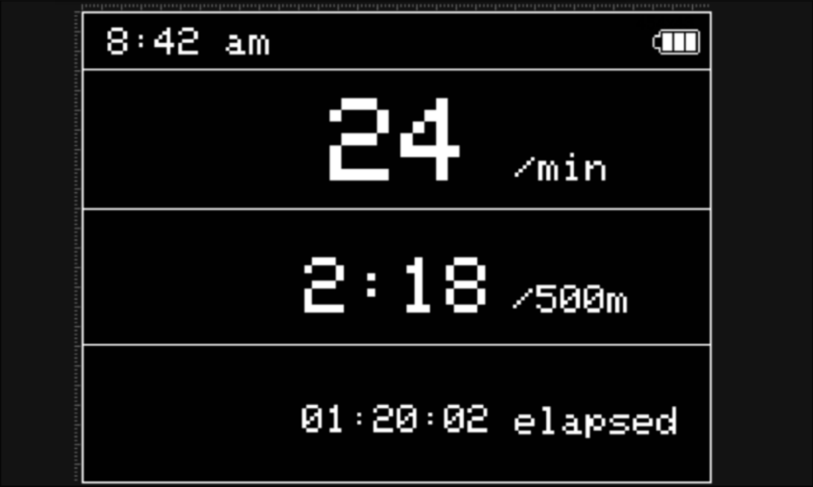
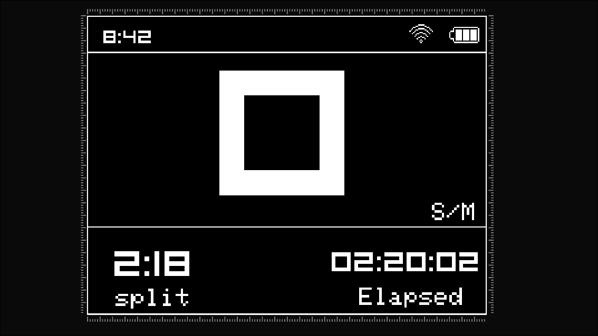
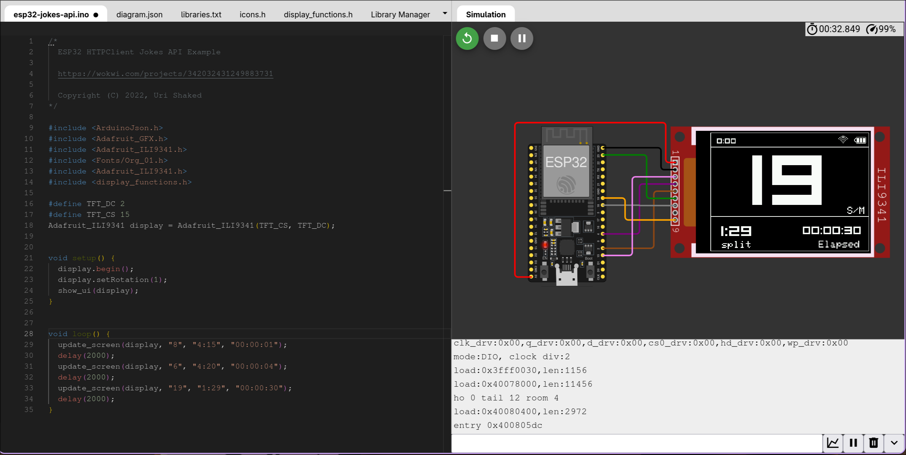
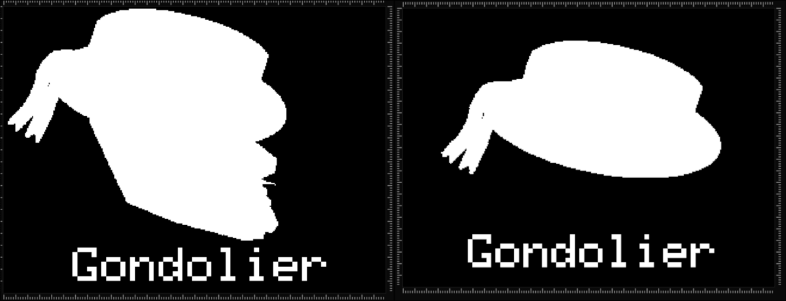

<script>
MathJax = { tex: { inlineMath: [['$','$']] } };
</script>
<script src="https://cdn.jsdelivr.net/npm/mathjax@3/es5/tex-chtml.js"></script>


# Gondolier

## An open source rowing monitor

**Preface**

This document explains Gondolier's goals, design, components, and the rationale behind major decisions. It is intended for engineers who want to understand, maintain, or extend the rowing monitor hardware and firmware.

**Summary**

Gondolier is a compact on-boat rowing monitor that detects rowing strokes in real time using an IMU and a TensorFlow Lite model. It displays metrics (stroke rate, split time, session timer) and syncs session data to a phone app over Bluetooth Low Energy (BLE) for further analytics and social sharing.

**History and Motivation**

Rowers and coaches benefit from immediate, accurate stroke detection and per-stroke metrics. Existing solutions are bulky, old and expensive. Gondolier provides a lightweight, dedicated device that sits on the rigging, giving rowers immediate feedback and long-term session sync.

**Context and Goals**

- Real-time stroke detection with low latency.
- Long battery life and robust behaviour on a small microcontroller.
- Simple, readable display for use while rowing.
- Easy transfer of session data to a phone for analysis and sharing.
- Open-source hardware and firmware for reproducibility.

**System Overview**

At a high level Gondolier consists of:

- A small microcontroller (ESP32-S3-MINI-1) running firmware written as an Arduino/ESP project; main firmware is in `embedded-code.ino`.
- An IMU (QMI8658) delivering accelerometer and gyroscope data, abstracted by `accelerometer.h`.
- A 240×320 ILI9341 TFT display driven via `Display.h`.
- An on-device ML model (`model.tflite` and supporting headers `model.h`, `model_data.h`) that classifies input windows into stroke / non-stroke.
- BLE transfer routines in `networking.h` to send compressed session data to a phone app.

**Architecture and Components**

This section describes components and their responsibilities, and how they interact.

1. Hardware
- MCU: ESP32-S3-MINI-1 \- chosen for its dual-core RISC-V CPU, integrated WiFi and BLE, and sufficient flash/ram to host a small TFLite model.
- IMU: QMI8658 \- a 6-axis sensor (3-axis accel, 3-axis gyro). 125Hz sampling provides enough resolution to detect rowing strokes while balancing power consumption.
- Display: 240×320 TFT (ILI9341) \- low-power, readable in sunlight with SPI interface.
- Power: LiPo battery \+ regulator; the firmware supports sleep modes between strokes to conserve power.

2. Firmware (high level)

The firmware organizes functionality into modules:

- `accelerometer.h` \- handles IMU initialization, configuration and provides a ring buffer of recent acceleration samples.
- `model.h` / `model_data.h` \- contain the TensorFlow Lite Micro model and inference integration code.
- `Display.h` \- UI primitives for the on-boat display: main screen, metric updates, and minimal menus.
- `networking.h` \- BLE advertisement, GATT services, and a simple protocol to upload sessions to the phone app.
- `embedded-code.ino` \- application entrypoint, task orchestration, and state machine for session lifecycle.

3. Machine learning model
   The stroke detection model is trained offline on labeled IMU windows and exported to TFLite (`model.tflite`). At runtime we run a fixed-length sliding window of accelerometer magnitude through the TFLite Micro interpreter. The model outputs a probability (stroke / not-stroke) and the firmware applies a detection algorithm (threshold \+ debounce) to produce discrete stroke events.


**Electronic Assembly:**

The electronic assembly was straight forward, as this is only a prototype, we used dev boards where possible. For the ESP32, I used a clone of the adafruit feather TFT with an integrated accelerometer; the accelerometer communicates with the MCU using I2C. The screen was a cheap TFT breakout board which was connected using the serial peripheral interface (SPI) for communication, the entire assembly was done using a perforated prototyping board. A 3.3v compatible SD card module was connected using SPI as well and so unique “chip select” pins were assigned to each SPI module. Buttons were added for control and were wired for pullup resistors. Debouncing capacitors were used to smooth button, accelerometer and voltage across the full circuit, a CP2104 Li-Po battery management system board was connected with a battery for the duration of data collection but this was removed after for safety.

Simplified Schematic of the rowing tracker


Breakout image of the electronics:

Image of the full electronics stack:
**Design Decisions and Trade-offs**

- Model size and sampling rate: We limit the input window and sampling frequency to keep RAM usage and CPU cost low. This restricts model complexity but fits TFLite Micro on the ESP32-S3.
- BLE for sync: BLE provides easy phone connectivity and low power, but imposes throughput constraints which we address by batching and compressing session data.
- Display choice: SPI TFT gives readability and low pin count. It is less power-efficient than e-paper but allows real-time numeric updates.

**Obtaining Training Data**

- Data Collection: The initial step of the project was data collection, before we could write the main firmware or prepare the model, we needed to collect a large amount of data, this was a lengthy process. We tested data collection and data processing in a plethora of different ways. World rowing champion, Sally Cudmore, kindly took our rowing tracker on to her boat so we could collect the necessary data. To try and make the process as quick as possible, we collected data at 800hz, filling the integrated buffer on the accelerometer and polling the data as frequently as possible, we collected both accelerometer and gyroscope data in case we would want to use both in the final model. We also ensured the device was rigidly connected to the boat to prevent noise from it bouncing around. While on the water, per our request, Sally did a variety of different strokes. This included strokes at different speeds and stroke rates, half strokes, low power and high power strokes. We collected a total of 2 hours of rowing data, roughly 800 data points.
- Data processing: At first, we used matplotlib to plot all three axes of the acceleration and gyroscope. This informed us very quickly that the rotational data was unnecessary so we immediately removed it. Looking at the acceleration data, the x axis was just complete noise, the y axis showed a small semblance of rowing strokes and the z axis showed clear rowing stroke, this made a lot of sense, the accelerometer was mounted in a way that its z axis was pointing in the direction of the boats motion, it was tilted up slights so the screen was visible to Sally and so some of the motion was also present in the y axis, the x axis was positioned perpendicular to the motion of the boat so the only acceleration in that axis was the wobbling of the boat due to waves and instability.

Unprocessed z axis accelerometer data

Because we knew that rowers would want to tilt the device at different angles so they could view the screen in boats with different designs, we had to process the data in a way that would be totally agnostic to device orientation. To achieve this, we used simple trigonometry. Obtaining the magnitude of the Y and Z axes, where the data is present, turned it into a vector of acceleration that would not change depending on orientation.

$$
\vec{v} = \sqrt{Y^2 + Z^2}
$$

As is clearly visible in the image below, the noise from the accelerometer is very high, despite having a clear signal, it is very messy data, the next step was to pass it through a low pass filter to cut out the high frequency noise, a simple 100 sample window rolling average was used

$$
\bar{m}[n] = \frac{1}{50} \sum_{k=0}^{49} \sqrt{Y[n-k]^2 + Z[n-k]^2}
$$

Noise signal before rolling average

Blue line inside orange shows the processed signal compared to orange noisy signal

Lastly to remove gravitation anomalies, another rolling average was done but with a sample window size of 500, this acted as a high pass filter allowing the stroke data to pass through but not changes in the tilt of the boat

$$
\bar{m}[n] = \frac{1}{500} \sum_{i=0}^{499} \frac{1}{50} \sum_{k=0}^{49} \sqrt{y[n-i-k]^2 + z[n-i-k]^2}
$$

30 seconds of processed data showing 9 strokes


- Creating stroke and non stroke training windows: Now that the data is cleaned and processed we had to decide how to best package the data to feed into the neural network, we tried a variety of methods for this, where we struggled was finding non stroke data, typically once on the water, Sally will row stroke after stroke until she is done with little rest time so to get non stroke data is very difficult, i created a python script that looked for peaks over a certain height, it labelled these peaks and then created windows across the whole dataset, overlapping with an offset of 1 second, the % of the stroke in each window was labelled based on where in the stroke the spike occurred and then a graph of each stroke was presented by the code to be manually approved or rejected, all windows that had less than 70% of a stroke as labelled as not a stroke. In the end, 400 windows were given to the model to train on, 300 stroke windows and 100 non stroke windows. This was a smaller dataset than we had wanted to work on but it still functioned well. This was the 8th different way we tried to window the data, it was difficult and involved a lot of trial and error and any attempt to use AI on this task threw us awry as this has never been attempted before publicly so there is no data online


  Manual review of stroke data

  Automated review of stroke data of entire 40 rowing session


**Data Flow and Algorithms**

1. Acquisition: The IMU runs at a sampling frequency of 125Hz. The accelerometer vectors are read into a circular buffer.

2. Processing: in order to negate the issue of device orientation in the boat, the magnitude of the y and z axis data is taken, this makes the stroke detection orientation agnostic, this is put through a further high pass filter to remove gravity anomalies and a low pass filter to remove noise from the sensor

3. Windowing: Every inference step takes the recent 850 samples after processing. The data is then normalised using a moving scale and then put passed to the model.

4. Inference: The TFLite Micro interpreter (`model.h`) runs the model on the input window and returns a probability for a stroke. The firmware compares the probability to a threshold and uses a small state machine with hysteresis to avoid false positives from boat motion.

1. Event generation

Confirmed strokes are timestamped and added to the session buffer. Stroke rate (spm) and split time are computed using recent stroke intervals.

**Firmware Structure and Files**

- `embedded-code.ino` \- Main loop and mode management (idle, rowing, paused, sync). Handles button input and session start/stop.
- `accelerometer.h` \- IMU init, sample acquisition, buffer API: `void imu_init(); bool imu_has_samples(); void imu_pop_sample(Sample *s);`
- `Display.h` \- APIs: `display_init()`, `display_mainScreenUpdate(spm, split, elapsed)`, `display_drawMessage()`.
- `networking.h` \- BLE advertise, GATT service. Uses a small framing protocol: session metadata, then compressed sample/stroke records.
- `model.h` / `model_data.h` / `model.tflite` \- model binary integrated as const array plus code to call interpreter and return detection probability.

Build, Flashing, and Development

The project is structured as an Arduino-style sketch with `embedded-code.ino` at the root and headers in the same folder. Two common ways to build and flash:

- Arduino IDE / Arduino CLI
  - Install board support for `esp32` (Espressif) and select ESP32-S3 board.
  - Open `embedded-code.ino` and upload.
- PlatformIO
  - Create a `platformio.ini` with the `espressif32` platform and `board = esp32-s3-devkit` (or similar). Use the `upload` and `monitor` targets.

**Development Tips**

- Enable `#define DEBUG_SERIAL` to get verbose logs of sensor values, inference probabilities, and BLE state.
- When tuning the model threshold, log `probability` and `timestamp` pairs to serial and replay them offline.

**Testing and Evaluation**

Unit testing on-device is limited, but key techniques used:

- Serial logging: capture IMU streams and model outputs for offline validation and visualization.
- Cross-validation: model trained with k-folds and tested on held-out boat types.
- On-device A/B: compare timestamps produced by the model with timestamps recorded by a coach and compute precision.

**Performance and Resource Usage**

- Model memory: The memory management proved a difficult task, with 360Kb of DRAM and 8MB of PSRAM we were extremely limited. Where possible, we removed things from ram and as much as possible tried to keep the larger items in PSRAM bypassing DRAM altogether when accessing it. The model alone took up nearly 1.2MB of RAM
- CPU load: Inference is invoked on a background task at a sliding-window cadence. CPU usage is modest.
- Power: the IMU’s internal buffer is used so that we only need to poll data from its registers every few milliseconds instead of constantly, this helps to reduce power usage as the i2c busses are kept mostly quiet. The display is refreshed at a typical rate of 1Hz when there is no new data to send, this reduces power consumption

**Security, Privacy, and Safety**

- BLE pairing: Use bonding and minimal authentication in `networking.h` to avoid accidental data exposure.
- Data retention: Session data stored on-device is limited in size, statistics calculated on device are not stored as this can be done quickly on the phone or the backend server
- Physical mounting: The device is intended to be mounted securely; firmware checks for accelerometer saturation and warns on improbable data.


**Display**

1. Technical Specification
- 240x320 pixel display screen with touchscreen capabilities.
- Open source graphics library provided by adafruit.
- 4 white-LED backlight providing brightness with individual pixel RGB color support.
- fastSPI communication standard used for a fast and responsive UI.
- screen UI and logos designed in Lopaka.app.
- screen development done on wokwi.com.

2. Design Choices

Multiple factors went into the decision for the user interface layout. At the top of the list, visual clarity was the number one priority.

The embedded electronics use the screen in a horizontal layout, with the longest part of the screen being at the top and bottom. This provided us with a large canvas to give the split time and elapsed time equal room, while giving away most of the screen realestate to the strokes per minute counter.

Although capable of displaying colors, the UI is primarily using black and white to display the elements. This was done to ensure proper visibility while working on a rowboat, as adding color to the text or the numbers would make it harder to read.

Even though the screen is capable of touchscreen funciontality, we have decided against using it, since wrong inputs could occur due to the nature of the wet environment that the product would be in.

The initial screen layout consisted of a top bar, for displaying the time, and equal-space segments for the strokes per minute, split and elapsed time.

<p align="center">
  
</p>
After review and feedback, this screen layout proved suboptimal. The most important piece of information on the screen for a rower will be the strokes per minute. Even though it is displayed as the biggest element, it still might not be clear enough for the number to be glanced at from a distance, or if the screen gets wet. Additionally, the font chosen proved not legible enough, especially since the same font was used for the text and the numbers. This led to many rough pixelated edges, making it harder to see the information needed.

<p align="center">
  
</p>

The final UI screen builds upon the feedback received in all aspects. 
- The "S/M" label was made smaller and moved to the far side to the right of the screen, while the counter was made almost twice as big.
- The font for the numbers was changed to a much more simplistic and sleeker font, allowing for easy reading of the numbers while under stress. 
- The split time and elapsed time have been moved to their own section and are much smaller since, while this information is good to have, it is not the main priority of the rower.
- Once our communication protocol was chosen, a wifi logo was added to the top bar of the display.

3. Tools, Functions and Workflow

When the final rendition of the UI was settled, work began on creating update functions for each element. The focus was on providing update functions to change the main UI elements pertaining to rowing, and the option to change all of these with a single function call. More functions were added in the final design as to change the color of the Wifi symbol to show when data transfer is ready, and for changing the current time in the top left.

- ``void show_ui(tft)`` initial set up of the UI and their elements, like wifi, battery, timer, strokes, split and time.
- ``void splashscreen(tft)`` displays the logo at startup.
- ``void update_timer(tft, time)`` updates the total time elapsed screen element.
- ``void update_split(tft, split)`` updates the split time screen element.
- ``void update_strokes(tft, strokes)`` updates the strokes per minute screen element.
- ``void update_screen(tft, strokes, split, time)`` combines the 3 functions above into 1 for easily updating the main UI elements with one command.

Physical access to the board was limited, so to test out the UI, the code, and to ensure everything displayed properly, an esp32 emulator website [wokwi.com](https://wokwi.com/) was used. This website allowed us to work in parallel and then sync our work together using git.

<p align="center">
  
</p>

4. UI and Logo

[lopaka.app](https://lopaka.app/) is a webapp enabling an easy and straightforward process to designing screen interfaces for embedded electronics. Using this website, we were able to draft and iterate upon multiple screen layouts.

The website has a feature that allows for image uploads for creating custom logos. In reality, this feature is built upon the adafruit graphics library and image reader library, meaning that while helpful, the logo import and UI design could have been done without reliance on this software.

<p align="center">
  
</p>

The final aspect of UI development was the splashscreen greeter. Once the logos were finished, the final choice for which logo to use came down to the two that can be seen above. We decided on going the second logo, mentioning how we might benefit from a simpler and sleeker logo choice, especially when displayed on a small screen.


**Machine Learning Model**

In order to achieve more accurate stroke detection we chose to use a machine learning model in conjunction with the accelerometer threshold. The model used is a small neural network consisting of approximately 50,000 parameters that was made with Keras in TensorFlow Lite and then converted to run on the ESP32-S3 using the LiteRT library from Google and run on the microcontroller using the C++ library from LiteRT.


**Technologies and Libraries Used**

**TensorFlow Lite**
The main library we used to make the model was TensorFlow Lite. Within TFLite, Keras was used for the creation of the model. We went with this library as it was already familiar to us and has a robust and easy to deploy framework for neural networks. The main challenge which we faced was the extreme size restrictions for getting the model to run on the microcontroller.

**Google Colab/Jupyter Notebook**
We opted to use Jupyter Notebooks running in Google Colab for the development and training of the model. We opted for Jupyter as these technologies were already familiar to us and provide a pretty easy way to run the code we'd be using for the model. The reason we used Google Colab is because we had a Machine Learning module last semester and we still had credits left over for Google's Tensor Processing Units so we'd be able to train the model much faster than on our own hardware.

**Dataset**
Once the processed dataset was completed, it was passed through a python script and a CSV was made for all of the stroke windows, as discussed earlier. Each window was approximately 3.4 seconds. For use with the notebook, the ClassName and SampleIndex columns as they were not necessary. From there we split the dataset into the training set and the test set. With went with an 80/20 split training to test. The training set was used for the training of the model and then the test set was unseen data set aside for the model to be evaluated on to see how accurate it was.

**Model Architecture**
Initially, we tried making a sequential Keras model by hand. We started with a very basic model to get an idea of performance before going on to make a tuned model with a similar architecture to see if we get get better performance. Regardless of what model we went for, it would have to be quite small. There was a hard limit of 80,000 parameters due to the memory constraints of the ESP32-S3, even with the additional PSRAM we had.

**Layers**
We used the same kinds of layers in each model, they are as follows

*1 Dimensional Convolutional Layer (Conv1D)*
![[conv.png]]
A **one-dimensional convolutional layer (Conv1D)** applies a set of learnable filters that slide along a one-dimensional input sequence. Each filter performs a convolution operation, computing weighted sums of local input segments to detect patterns within the data.

Conv1D layers are commonly used for **sequential or temporal data**, such as time series, signals, or text. By learning multiple filters, the layer can identify different local features (for example spikes, trends, or repeating patterns).

Each filter produces a **feature map**, and the collection of these maps forms the output of the layer. During training, the filter weights are adjusted through backpropagation so that the network learns the most useful features for the task.

Since the Gondolier model is dealing with sequential accelerometer readings, essentially just ordinary arrays, Conv1D is perfect.


*1 Dimensional Max Pooling Layer*
![[maxpooling.png]]

A **one-dimensional pooling layer (Pooling1D)** reduces the spatial size of feature maps generated by convolutional layers. This is done by summarising small segments of the input using a simple operation such as taking the maximum or average value. 

We went for max pooling, where the maximum value within each window is selected. Pooling layers serve several purposes:

- **Reducing computational complexity** by decreasing the size of feature maps
- **Improving generalisation** by making representations more robust to small shifts in the input
- **Highlighting the most important features** detected by convolutional filters

Pooling layers therefore help the network retain essential information while discarding less relevant detail.

We used pooling layers since it is common ML practice, but also more especially because we really needed to reduce computational complexity for use with the ESP32.

*Flattening Layer*
![[flatten.png]]

A **flattening layer** converts multi-dimensional feature maps into a one-dimensional vector.

After convolution and pooling operations, the data is typically represented as structured feature maps. However, fully connected layers require a one-dimensional input. The flattening layer performs a simple reshaping operation that preserves all values but reorganises them into a single vector.

This transformation enables the extracted features from earlier layers to be passed into the classification or prediction stage of the network.

This layer doesn't actually do any training, and is just used for feeding data to the final dense layers.

*Dense Layer*
![[dense.png]]

A **dense layer**, also known as a **fully connected layer**, connects every neuron in the layer to every neuron in the previous layer. Each connection has an associated weight that is learned during training.

Dense layers combine the features extracted by earlier layers to produce higher-level representations and final predictions. The output of each neuron is typically computed as a weighted sum of its inputs followed by a non-linear activation function.

These are the bread and butter of the machine learning world, being some of the most commonly used layers, and also being used at the end of non standard networks like our convolutional network.

**First model**
The first model we used had a basic architecture with estimated values and no tuning. We knew this model would not be fit for purpose, but we used it as a starting point to get a very rough idea of what kind of accuracy we could expect. The model started with an input layer of size 850, with one input vertex for each datapoint in our stroke data frames. This frame was given to two convolutional/pooling pairs, before then going through a flattening layer and a dense layer, then being passed to a final dense layer with a single output giving a real value between 0 or 1 for stroke probability.

The dense and convolutional layers used the **Rectified Linear Unit (ReLU)** activation function. Activation functions introduce **non-linearity** into the network, allowing it to learn complex patterns and relationships in the data. ReLU functions by returning the input unchanged if it is greater than 0 or returning 0 if the input is less than 0.

$$f(x)=max(0,x)$$

ReLU is nice as it is very computationally simple, and since many neurons will output 0 which is better for generalisation and training efficiency.

The final output dense layer used the **Sigmoid** activation function. Sigmoid is commonly used in binary classification models such as Gondolier as it transforms any real-valued input into a value between **0 and 1**, which allows the output to be interpreted as a probability.

$$σ(x)=\frac{1}{1+e^{-x}}​$$

Where $x$ is the input value and $e$ is the base of the natural logarithm. We used Sigmoid to get the probability of the inputted frame being a stroke.

The number of filters we used for the convolutional layers were 16 and 32 respectively, and we used 16 units for the penultimate dense layer. This model had 109K parameters, which was far too much for our purposes, but we were able to achieve a good test set accuracy of 85%. 

**Tuned Model**
We next moved on to making a more sophisticated tuned model which would hopefully increase performance while decreasing size. A tuner trains several models using hyperparameters which it can choose from in order to find the best model. The hyperparameters we gave the model were the number of convolutional/pooling layer pairs to include, the number of filters the convolutional layers could use and also the learning rate of the model. The learning rate is related to optimisers used for the model, but the layer filters were the most important choice. Interestingly, the model chose the same architecture of 2 Conv1D/MaxPool1D pairs, but did choose different values for the filters. It chose to use 48 and 16 filters respectively.

![[model.png]]

**Comparison**
The second model had a marginally higher accuracy of around 87%, however it did achieve a massive improvement in model size, with this model having only 57K parameters, nearly half of what the first model had while still being well within the 80K parameter limit for the microcontroller.

We were very happy with this second model. While we could have done further experiments, time constraints limited us as training took some time, so we decided to proceed with the second tuned model.

**Model Conversion**
The LiteRT library provides a simple function used to convert Keras models into .tflite files that can be used by the C++ library on the microcontroller. 

```python
converter = tf.lite.TFLiteConverter.from_keras_model(best_model)

tflite_model = converter.convert()

with open(os.path.join(base_dir, "model.tflite"), 'wb') as f:
f.write(tflite_model)
```

With this we now had our trained model ready to go for the microcontroller. After this we used the `xxd` command to convert the .tflite model to our final C array.

```
xxd -i converted_model.tflite > model_data.cc
```

The final size of the model was 1.4 MB, on the large side but definitely usable, and with our decision to directly address the 8MB of PSRAM, this was well within acceptable boundaries.

**Future Work and Open Questions**

- Model improvements: explore multi-channel inputs (accel \+ gyro) or transformer-lite architectures to improve precision.
- Energy optimization: move more processing into the IMU and avail of its movement detection features
- Extended telemetry: add ANT+/NMEA compatibility for integration with existing rowing telemetry ecosystems.
- Radio transmission: add a radio transmission system for communication with a device held by the coach so they can get the same data live
- GPS: integrate GPS for positional accuracy and speed tracking

**Appendix A \- File map and responsibilities**

- `embedded-code.ino`: application entrypoint, state machine
- `accelerometer.h`: IMU driver and buffering
- `Display.h`: screen drawing and UI
- `networking.h`: BLE services and sync protocol
- `model.h`, `model_data.h`, `model.tflite`: model binary and inference glue
- `model.h` contains wrapper functions: `void model_init(); float model_infer(float *input);`

**Appendix B \- How stroke detection works (algorithm)**

1. Preprocess samples: compute magnitude \= sqrt(ax^2 \+ ay^2 \+ az^2) and subtract a rolling mean to remove gravity.
2. Form windows of 850 samples and normalize each window.
3. Call TFLite Micro to get stroke probability p.
4. If p \> threshold and not in the refractory window, store stroke event.

**Appendix C \- Contributors and references**

Contributors:

- Hugo Guenebaut \- Embedded systems lead
- Emin Aksoy \- Machine learning engineer
- Nixie \- Embedded UI designer
- Mark \- Communications and radio engineer
-

References:

- TensorFlow Lite Micro documentation \- [https://www.tensorflow.org/lite/micro](https://www.tensorflow.org/lite/micro)
- ESP32-S3 datasheet \- [https://documentation.espressif.com/esp32-s3\_datasheet\_en.pdf](https://documentation.espressif.com/esp32-s3_datasheet_en.pdf)
- QMI8658 datasheet \- [https://qstcorp.com/upload/pdf/202202/QMI8658C%20datasheet%20rev%200.9.pdf](https://qstcorp.com/upload/pdf/202202/QMI8658C%20datasheet%20rev%200.9.pdf)
- ILI9431 datasheet \- [https://cdn-shop.adafruit.com/datasheets/ILI9341.pdf](https://cdn-shop.adafruit.com/datasheets/ILI9341.pdf)
