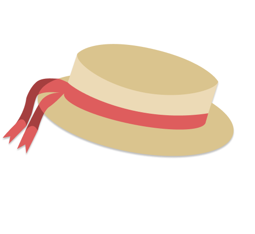
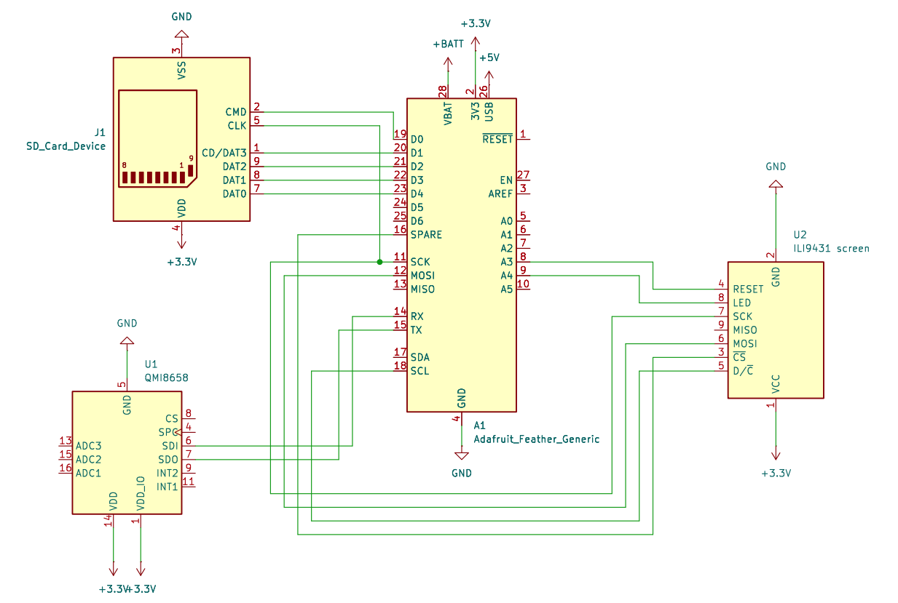
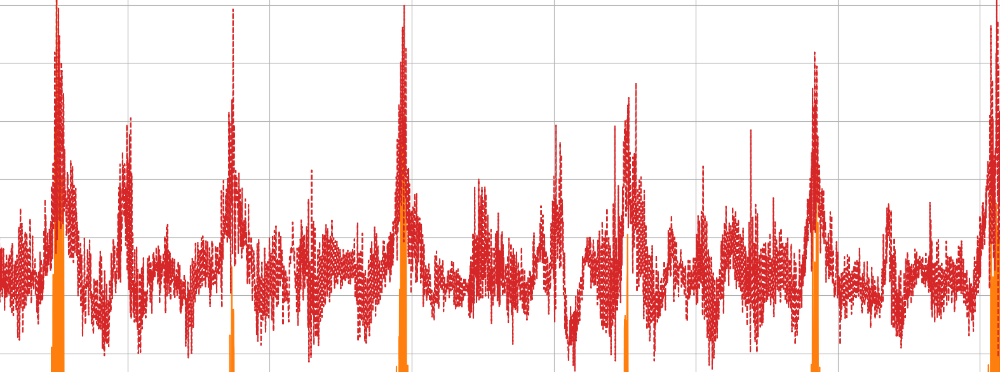
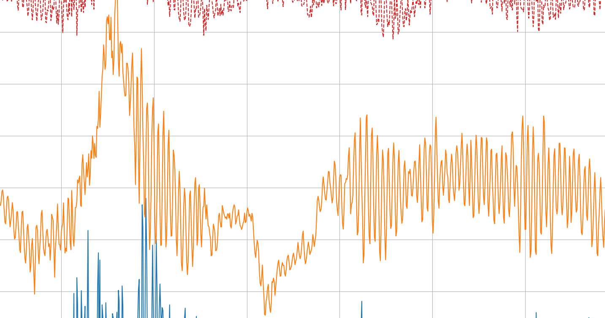
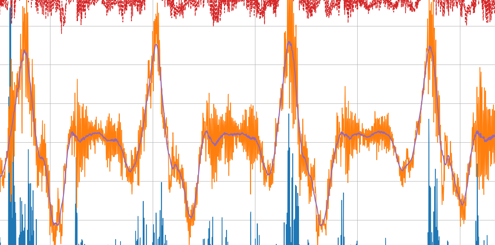
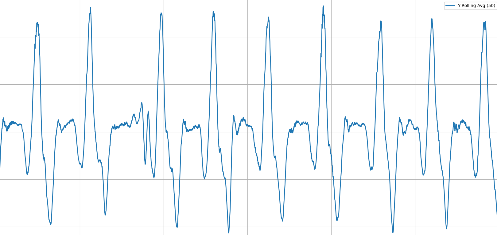
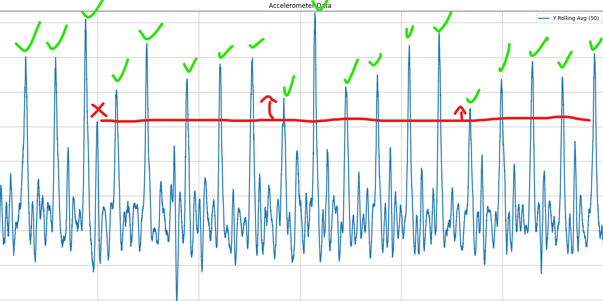
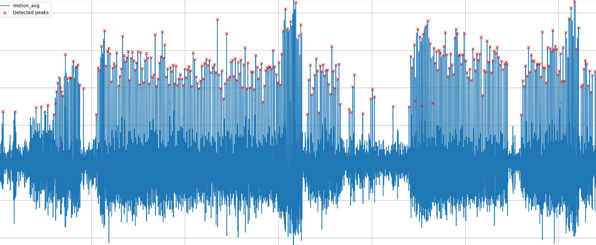

# Gondolier
An Open Source Rowing Monitor
#### Group 4

#### Group Members
- Hugo Guenebaut
- Emin Aksoyg
- Nixie
- Hleb Slyusar
- David Fresno
- Mark Cannavan

**Preface**

This document explains Gondolier's goals, design, components, and the rationale behind major decisions. It is intended for engineers who want to understand, maintain, or extend the rowing monitor hardware and firmware.

**Summary**

Gondolier is a compact on-boat rowing monitor that detects rowing strokes in real time using an IMU and a TensorFlow Lite model. It displays metrics (stroke rate, split time, session timer) and syncs session data to a phone app over Bluetooth Low Energy (BLE) for further analytics and social sharing.

**History and Motivation**

Rowers and coaches benefit from immediate, accurate stroke detection and per-stroke metrics. Existing solutions are bulky, old and expensive. Gondolier provides a lightweight, dedicated device that sits on the rigging, giving rowers immediate feedback and long-term session sync.

**Context and Goals**

- Real-time stroke detection with low latency.  
- Long battery life and robust behaviour on a small microcontroller.  
- Simple, readable display for use while rowing.  
- Easy transfer of session data to a phone for analysis and sharing.  
- Open-source hardware and firmware for reproducibility.

**System Overview**

At a high level Gondolier consists of:

- A small microcontroller (ESP32-S3-MINI-1) running firmware written as an Arduino/ESP project; main firmware is in `embedded-code.ino`.  
- An IMU (QMI8658) delivering accelerometer and gyroscope data, abstracted by `accelerometer.h`.  
- A 240×320 ILI9341 TFT display driven via `Display.h`.  
- An on-device ML model (`model.tflite` and supporting headers `model.h`, `model_data.h`) that classifies input windows into stroke / non-stroke.  
- BLE transfer routines in `networking.h` to send compressed session data to a phone app.

**Architecture and Components**

This section describes components and their responsibilities, and how they interact.

1. Hardware  
- MCU: ESP32-S3-MINI-1 \- chosen for its dual-core RISC-V CPU, integrated WiFi and BLE, and sufficient flash/ram to host a small TFLite model.  
- IMU: QMI8658 \- a 6-axis sensor (3-axis accel, 3-axis gyro). 125Hz sampling provides enough resolution to detect rowing strokes while balancing power consumption.  
- Display: 240×320 TFT (ILI9341) \- low-power, readable in sunlight with SPI interface.  
- Power: LiPo battery \+ regulator; the firmware supports sleep modes between strokes to conserve power.

2. Firmware (high level)

The firmware organizes functionality into modules:

- `accelerometer.h` \- handles IMU initialization, configuration and provides a ring buffer of recent acceleration samples.  
- `model.h` / `model_data.h` \- contain the TensorFlow Lite Micro model and inference integration code.  
- `Display.h` \- UI primitives for the on-boat display: main screen, metric updates, and minimal menus.  
- `networking.h` \- BLE advertisement, GATT services, and a simple protocol to upload sessions to the phone app.  
- `embedded-code.ino` \- application entrypoint, task orchestration, and state machine for session lifecycle.  
    
3. Machine learning model  
   The stroke detection model is trained offline on labeled IMU windows and exported to TFLite (`model.tflite`). At runtime we run a fixed-length sliding window of accelerometer magnitude through the TFLite Micro interpreter. The model outputs a probability (stroke / not-stroke) and the firmware applies a detection algorithm (threshold \+ debounce) to produce discrete stroke events.  
   

**Electronic Assembly:**

The electronic assembly was straight forward, as this is only a prototype, we used dev boards where possible. For the ESP32, I used a clone of the adafruit feather TFT with an integrated accelerometer; the accelerometer communicates with the MCU using I2C. The screen was a cheap TFT breakout board which was connected using the serial peripheral interface (SPI) for communication, the entire assembly was done using a perforated prototyping board. A 3.3v compatible SD card module was connected using SPI as well and so unique “chip select” pins were assigned to each SPI module. Buttons were added for control and were wired for pullup resistors. Debouncing capacitors were used to smooth button, accelerometer and voltage across the full circuit, a CP2104 Li-Po battery management system board was connected with a battery for the duration of data collection but this was removed after for safety. 

Simplified Schematic of the rowing tracker  

Breakout image of the electronics:

Image of the full electronics stack:  
**Design Decisions and Trade-offs**

- Model size and sampling rate: We limit the input window and sampling frequency to keep RAM usage and CPU cost low. This restricts model complexity but fits TFLite Micro on the ESP32-S3.  
- BLE for sync: BLE provides easy phone connectivity and low power, but imposes throughput constraints which we address by batching and compressing session data.  
- Display choice: SPI TFT gives readability and low pin count. It is less power-efficient than e-paper but allows real-time numeric updates.

**Obtaining Training Data**

- Data Collection: The initial step of the project was data collection, before we could write the main firmware or prepare the model, we needed to collect a large amount of data, this was a lengthy process. We tested data collection and data processing in a plethora of different ways. World rowing champion, Sally Cudmore, kindly took our rowing tracker on to her boat so we could collect the necessary data. To try and make the process as quick as possible, we collected data at 800hz, filling the integrated buffer on the accelerometer and polling the data as frequently as possible, we collected both accelerometer and gyroscope data in case we would want to use both in the final model. We also ensured the device was rigidly connected to the boat to prevent noise from it bouncing around. While on the water, per our request, Sally did a variety of different strokes. This included strokes at different speeds and stroke rates, half strokes, low power and high power strokes. We collected a total of 2 hours of rowing data, roughly 800 data points.  
- Data processing: At first, we used matplotlib to plot all three axes of the acceleration and gyroscope. This informed us very quickly that the rotational data was unnecessary so we immediately removed it. Looking at the acceleration data, the x axis was just complete noise, the y axis showed a small semblance of rowing strokes and the z axis showed clear rowing stroke, this made a lot of sense, the accelerometer was mounted in a way that its z axis was pointing in the direction of the boats motion, it was tilted up slights so the screen was visible to Sally and so some of the motion was also present in the y axis, the x axis was positioned perpendicular to the motion of the boat so the only acceleration in that axis was the wobbling of the boat due to waves and instability.

Unprocessed z axis accelerometer data  

Because we knew that rowers would want to tilt the device at different angles so they could view the screen in boats with different designs, we had to process the data in a way that would be totally agnostic to device orientation. To achieve this, we used simple trigonometry. Obtaining the magnitude of the Y and Z axes, where the data is present, turned it into a vector of acceleration that would not change depending on orientation. 

$$
\vec{v} = \sqrt{Y^2 + Z^2}
$$

As is clearly visible in the image below, the noise from the accelerometer is very high, despite having a clear signal, it is very messy data, the next step was to pass it through a low pass filter to cut out the high frequency noise, a simple 100 sample window rolling average was used

$$
\bar{m}[n] = \frac{1}{50} \sum_{k=0}^{49} \sqrt{Y[n-k]^2 + Z[n-k]^2}
$$

Noise signal before rolling average  

Blue line inside orange shows the processed signal compared to orange noisy signal  

Lastly to remove gravitation anomalies, another rolling average was done but with a sample window size of 500, this acted as a high pass filter allowing the stroke data to pass through but not changes in the tilt of the boat

$$
\bar{m}[n] = \frac{1}{500} \sum_{i=0}^{499} \frac{1}{50} \sum_{k=0}^{49} \sqrt{y[n-i-k]^2 + z[n-i-k]^2}
$$

30 seconds of processed data showing 9 strokes  

- Creating stroke and non stroke training windows: Now that the data is cleaned and processed we had to decide how to best package the data to feed into the neural network, we tried a variety of methods for this, where we struggled was finding non stroke data, typically once on the water, Sally will row stroke after stroke until she is done with little rest time so to get non stroke data is very difficult, i created a python script that looked for peaks over a certain height, it labelled these peaks and then created windows across the whole dataset, overlapping with an offset of 1 second, the % of the stroke in each window was labelled based on where in the stroke the spike occurred and then a graph of each stroke was presented by the code to be manually approved or rejected, all windows that had less than 70% of a stroke as labelled as not a stroke. In the end, 400 windows were given to the model to train on, 300 stroke windows and 100 non stroke windows. This was a smaller dataset than we had wanted to work on but it still functioned well. This was the 8th different way we tried to window the data, it was difficult and involved a lot of trial and error and any attempt to use AI on this task threw us awry as this has never been attempted before publicly so there is no data online  
    
    
    
  Manual review of stroke data  

  Automated review of stroke data of entire 40 rowing session  

**Data Flow and Algorithms**

1. Acquisition: The IMU runs at a sampling frequency of 125Hz. The accelerometer vectors are read into a circular buffer.

2. Processing: in order to negate the issue of device orientation in the boat, the magnitude of the y and z axis data is taken, this makes the stroke detection orientation agnostic, this is put through a further high pass filter to remove gravity anomalies and a low pass filter to remove noise from the sensor

3. Windowing: Every inference step takes the recent 850 samples after processing. The data is then normalised using a moving scale and then put passed to the model.

4. Inference: The TFLite Micro interpreter (`model.h`) runs the model on the input window and returns a probability for a stroke. The firmware compares the probability to a threshold and uses a small state machine with hysteresis to avoid false positives from boat motion.

5. Event generation

6. Sync: When a session is complete, the user can request the session over 
   bluetooth, and the device will stream metadata and stroke timestamps to the phone app for storage and analysis.

Confirmed strokes are timestamped and added to the session buffer. Stroke rate (spm) and split time are computed using recent stroke intervals.

**Bluetooth Low Energy (BLE) Sync**
Gondolier makes use of the Bluetooth Low Energy capabilities of the on-boat ESP32-S3 to sync session data to a phone app. The ESP32-S3 acts as a BLE peripheral/server, while the accompanying phone acts as the central/client. The phone initiates transfer by writing from a command, and Gondolier streams the session back as a sequence of binary notification packets. BLE was chosen for its universal support as well as its increased energy efficiency— suitable for a batter-operated device— and support for (small) data transfer when compared to Bluetooth Classic.

BLE roles and lifecycle
1. Advertising: The device advertises as `Gondolier` to nearby devices and 
   includes a custom service UUID, but does not send an advertising response 

2. Connection: The client connects and performs the GATT discovery process

3. Requests: The client writes `GET_SESSION` to the command characteristic

4. Data Transfer: The device sets status to `SENDING` and notifies packets 
   on the data characteristic

5. Finalising Data: The device sends an ender marker packet— `0xFF`— and 
   sets the status back to `IDLE`

6. On a disconnect, the device resumes advertising automatically

- GATT service and characteristics
The `networking.h` header implements a simple GATT service with characteristics for session metadata and stroke records:

A single custom service is exposed:

| Service UUID | 12345678-1234-1234-1234-123456789abc |
|--------------|--------------------------------------|

And three characteristics can be found in the GATT profile:

| **Characteristic** | **UUID**                                                                   | **Possible Values**                |
|--------------------|----------------------------------------------------------------------------|------------------------------------|
| Command            | 12345678\-1234\-1234\-1234\-123456789ab0 | GET\_SESSION \| PING               |
| Data               | 12345678\-1234\-1234\-1234\-123456789ab1 | \[Raw Data\]                       |
| Status             | 12345678\-1234\-1234\-1234\-123456789ab2 | IDLE \| SESSION\_READY \| SENDING  |

Where:
- Command characteristic is used by thed client to send ASCII commands
- Data characteristic is used by the device to stream binary pakcets containing metadata and stroke timestamps
- Status characteristic is a human-readable status string

**Firmware Structure and Files**

- `embedded-code.ino` \- Main loop and mode management (idle, rowing, paused, sync). Handles button input and session start/stop.  
- `accelerometer.h` \- IMU init, sample acquisition, buffer API: `void imu_init(); bool imu_has_samples(); void imu_pop_sample(Sample *s);`  
- `Display.h` \- APIs: `display_init()`, `display_mainScreenUpdate(spm, split, elapsed)`, `display_drawMessage()`.  
- `networking.h` \- BLE advertise, GATT service. Uses a small framing protocol: session metadata, then compressed sample/stroke records.  
- `model.h` / `model_data.h` / `model.tflite` \- model binary integrated as const array plus code to call interpreter and return detection probability.

Build, Flashing, and Development

The project is structured as an Arduino-style sketch with `embedded-code.ino` at the root and headers in the same folder. Two common ways to build and flash:

- Arduino IDE / Arduino CLI  
  - Install board support for `esp32` (Espressif) and select ESP32-S3 board.  
  - Open `embedded-code.ino` and upload.  
- PlatformIO  
  - Create a `platformio.ini` with the `espressif32` platform and `board = esp32-s3-devkit` (or similar). Use the `upload` and `monitor` targets.

**Development Tips**

- Enable `#define DEBUG_SERIAL` to get verbose logs of sensor values, inference probabilities, and BLE state.  
- When tuning the model threshold, log `probability` and `timestamp` pairs to serial and replay them offline.

**Testing and Evaluation**

Unit testing on-device is limited, but key techniques used:

- Serial logging: capture IMU streams and model outputs for offline validation and visualization.  
- Cross-validation: model trained with k-folds and tested on held-out boat types.  
- On-device A/B: compare timestamps produced by the model with timestamps recorded by a coach and compute precision.

**Performance and Resource Usage**

- Model memory: The memory management proved a difficult task, with 360Kb of DRAM and 8MB of PSRAM we were extremely limited. Where possible, we removed things from ram and as much as possible tried to keep the larger items in PSRAM bypassing DRAM altogether when accessing it. The model alone took up nearly 1.2MB of RAM  
- CPU load: Inference is invoked on a background task at a sliding-window cadence. CPU usage is modest.  
- Power: the IMU’s internal buffer is used so that we only need to poll data from its registers every few milliseconds instead of constantly, this helps to reduce power usage as the i2c busses are kept mostly quiet. The display is refreshed at a typical rate of 1Hz when there is no new data to send, this reduces power consumption

**Security, Privacy, and Safety**

- BLE pairing: Use bonding and minimal authentication in `networking.h` to avoid accidental data exposure.  
- Data retention: Session data stored on-device is limited in size, statistics calculated on device are not stored as this can be done quickly on the phone or the backend server  
- Physical mounting: The device is intended to be mounted securely; firmware checks for accelerometer saturation and warns on improbable data.

**Future Work and Open Questions**

- Model improvements: explore multi-channel inputs (accel \+ gyro) or transformer-lite architectures to improve precision.  
- Energy optimization: move more processing into the IMU and avail of its movement detection features  
- Extended telemetry: add ANT+/NMEA compatibility for integration with existing rowing telemetry ecosystems.  
- Radio transmission: add a radio transmission system for communication with a device held by the coach so they can get the same data live  
- GPS: integrate GPS for positional accuracy and speed tracking

**Appendix A \- File map and responsibilities**

- `embedded-code.ino`: application entrypoint, state machine  
- `accelerometer.h`: IMU driver and buffering  
- `Display.h`: screen drawing and UI  
- `networking.h`: BLE services and sync protocol  
- `model.h`, `model_data.h`, `model.tflite`: model binary and inference glue  
- `model.h` contains wrapper functions: `void model_init(); float model_infer(float *input);`

**Appendix B \- How stroke detection works (algorithm)**

1. Preprocess samples: compute magnitude \= sqrt(ax^2 \+ ay^2 \+ az^2) and subtract a rolling mean to remove gravity.  
2. Form windows of 850 samples and normalize each window.  
3. Call TFLite Micro to get stroke probability p.  
4. If p \> threshold and not in the refractory window, store stroke event.

**Appendix C \- Contributors and references**

Contributors:

- Hugo Guenebaut \- Embedded systems lead  
- Emin Aksoy \- Machine learning engineer   
- Nixie \- Embedded UI designer  
- Mark \- Communications and radio engineer  
- 

References:

- TensorFlow Lite Micro documentation \- [https://www.tensorflow.org/lite/micro](https://www.tensorflow.org/lite/micro)  
- ESP32-S3 datasheet \- [https://documentation.espressif.com/esp32-s3\_datasheet\_en.pdf](https://documentation.espressif.com/esp32-s3_datasheet_en.pdf)  
- QMI8658 datasheet \- [https://qstcorp.com/upload/pdf/202202/QMI8658C%20datasheet%20rev%200.9.pdf](https://qstcorp.com/upload/pdf/202202/QMI8658C%20datasheet%20rev%200.9.pdf)  
- ILI9431 datasheet \- [https://cdn-shop.adafruit.com/datasheets/ILI9341.pdf](https://cdn-shop.adafruit.com/datasheets/ILI9341.pdf)

